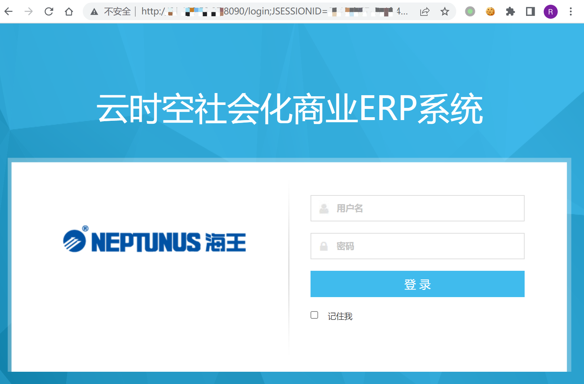
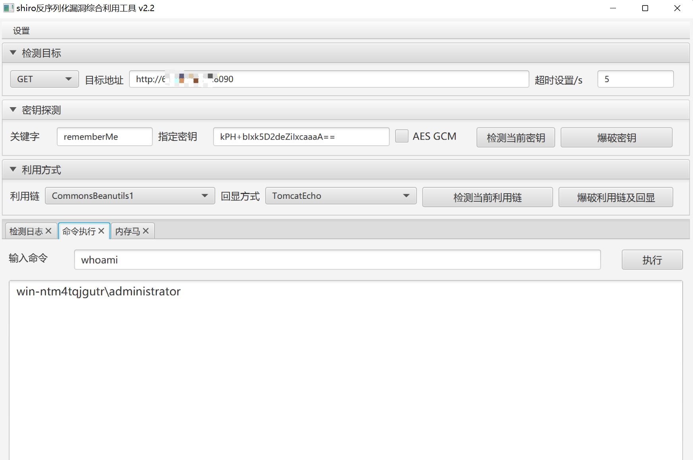

# 云时空 社会化商业ERP系统 Shiro框架 远程命令执行漏洞

## 漏洞描述

云时空 社会化商业ERP为 Shiro框架 ，使用了默认的密钥导致了远程命令执行漏洞

## 漏洞影响

```
云时空 社会化商业ERP系统
```

## 网络测绘

```
title="云时空社会化商业ERP"
```

## 漏洞复现

登录页面



默认密钥为

```
kPH+bIxk5D2deZiIxcaaaA==
```



