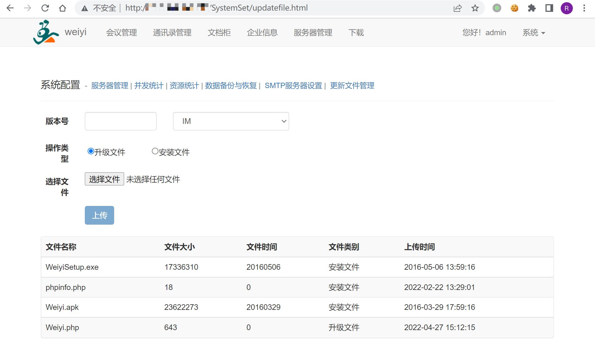

# 众望网络 微议管理系统 后台updatefile.html 任意文件上传漏洞

## 漏洞描述

众望网络 微议管理系统 后台updatefile.html页面任意文件上传漏洞，攻击者通过漏洞可以上传恶意文件控制服务器

## 漏洞影响

```
众望网络 微议管理系统
```

## 网络测绘

```
"微议管理系统"
```

## 漏洞复现

登录页面


默认口令 admin/admin, 服务器更新界面上传PHP文件



访问页面

```
/Updatefiles/文件名.php
```