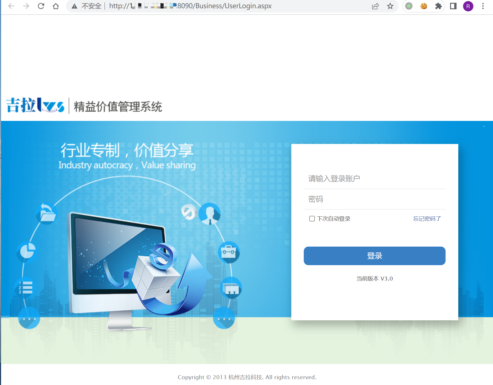
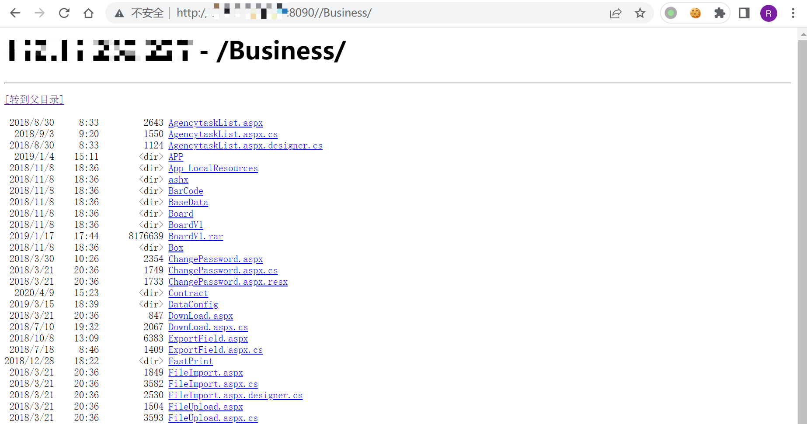

# 吉拉科技 LVS精益价值管理系统 Business 目录遍历漏洞

## 漏洞描述

杭州吉拉科技有限公司多个系统存在目录遍历漏洞，由于 /Business/ 访问控制不严，攻击者可利用该漏洞获取敏感信息。

## 漏洞影响

吉拉科技 LVS精益价值管理系统

## FOFA

```
"Supperd By 吉拉科技"
```

## 漏洞复现

登录页面



验证POC

```
/Business/
```

