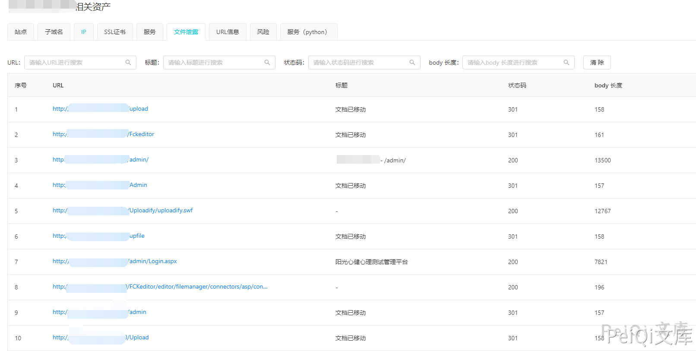
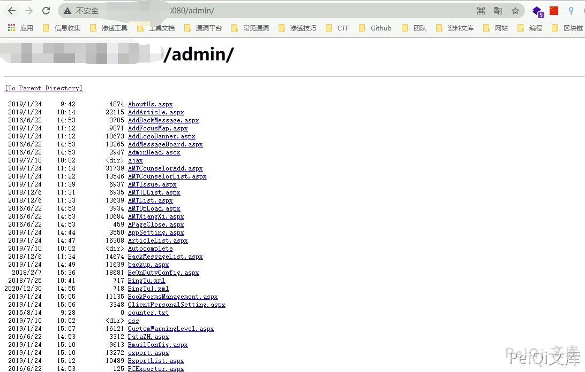
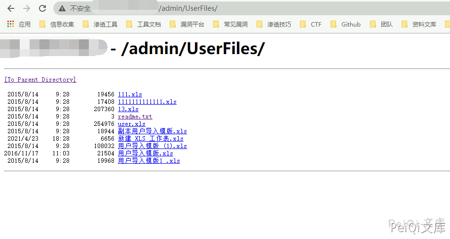

# 安徽阳光心健 心理测量平台 目录遍历漏洞 CNVD-2021-01929

## 漏洞描述

安徽阳光心健心理咨询有限公司心理测量平台存在目录遍历漏洞，攻击者可利用该漏洞获取敏感信息。

## 漏洞影响

```
安徽阳光心健 心理测量平台
```

## 网络测绘

```
icon_hash="-320896955"
```

## 漏洞复现

主页如下


扫描目录





访问 http://xxx.xxx.xxx.xxx/admin/





其中 http://xxx.xxx.xxx.xxx/admin/UserFiles/ 中还包含了用户信息可未授权下载


