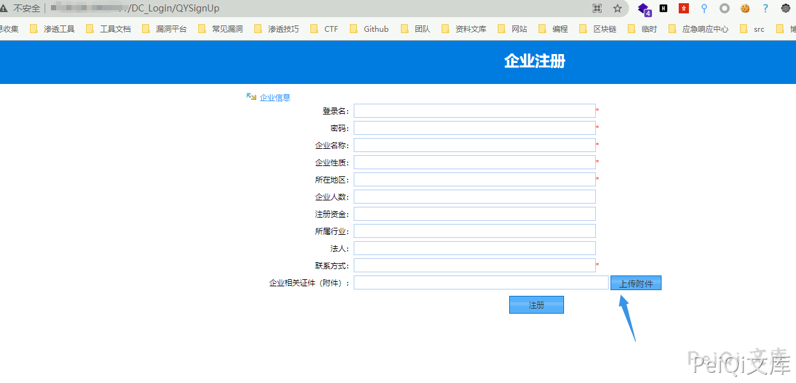
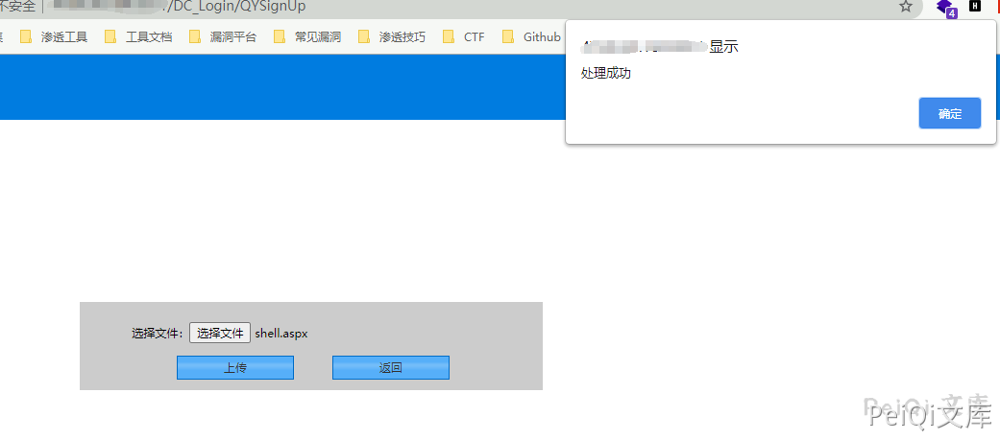
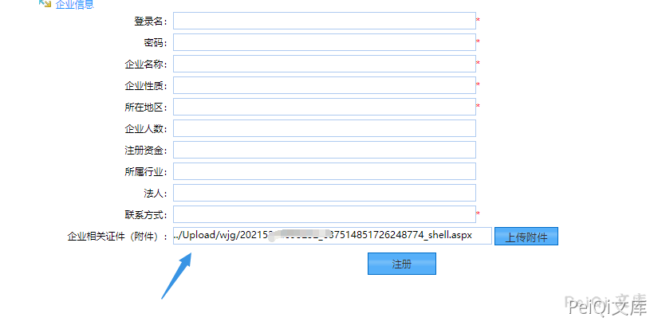
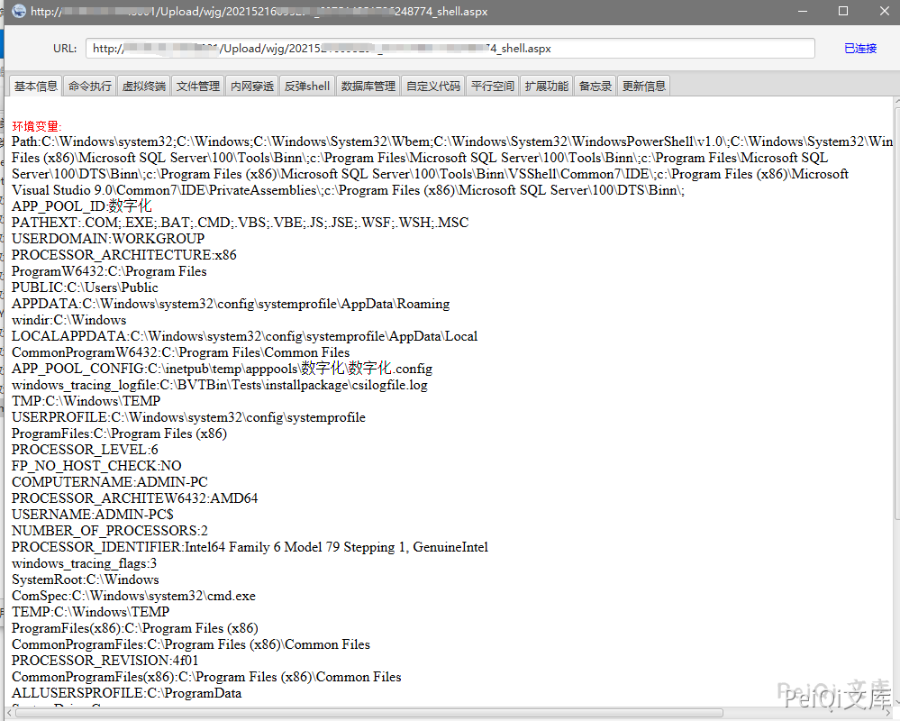

# 智慧校园管理系统 前台任意文件上传漏洞

## 漏洞描述

智慧校园管理系统前台注册页面存在文件上传，由于没有对上传的文件进行审查导致可上传恶意文件控制服务器

## 漏洞影响

```
智慧校园管理系统
```

## FOFA

```
body="DC_Login/QYSignUp"
```

## 漏洞复现

登录页面如下，只要存在企业用户注册就可能出现漏洞





这个地方的上传附件允许了任意文件上传，包括 aspx木马，上传后还会返回 webshell地址







上传的是冰蝎木马，直接连接


